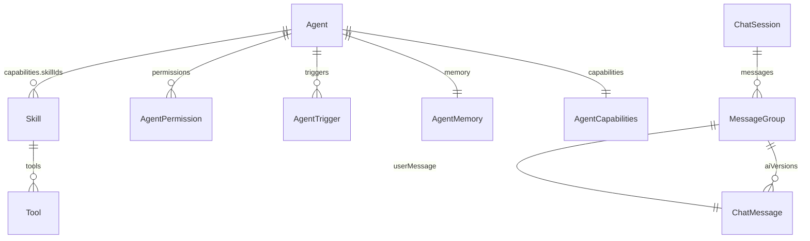

# MetaBlog Chat System

> 一套嵌入 VitePress 博客的 AI 对话系统，支持多 Agent、Skills 渐进式披露、Function Calling 工具链和消息版本管理。

---

## Quick Start

```bash
# 环境要求
Node.js 18+
pnpm / npm

# 开发
npm run dev          # 启动 VitePress + BFF API

# 类型检查
npx tsc --noEmit     # 应输出 0 errors
```

---

## 目录结构

```
features/chat/
├── api/                          # 网络层（Provider + Service + Config）
│   ├── config.ts                 # 88 个 API 端点统一定义
│   ├── providers/                # LLM Provider 抽象
│   │   ├── BaseProvider.ts       #   基类：消息转换、流式解析、多模态
│   │   ├── DeepSeekProvider.ts   #   DeepSeek（含 R1 推理模式）
│   │   ├── models.ts             #   模型注册表（DeepSeek / Kimi）
│   │   └── types.ts              #   Provider 接口定义
│   └── services/                 # 后端 CRUD 服务
│       ├── aiService.ts          #   ★ 核心：对话 + Function Calling 循环
│       ├── chatStorage.ts        #   Session/Message CRUD（→ /api/sessions）
│       ├── agentStorage.ts       #   Agent/Skill CRUD（→ /api/agents, /api/skills）
│       ├── storage.ts            #   消息版本管理（v2 MessageGroup）
│       ├── sessionLogger.ts      #   会话级日志记录
│       ├── logger.ts             #   全局结构化日志
│       ├── multimediaService.ts  #   图片/视频 Base64 + Kimi 多模态
│       └── index.ts              #   统一导出（别名避冲突）
│
├── components/                   # Vue 组件
│   ├── chat/                     #   聊天 UI
│   │   ├── ChatLayout.vue        #     ★ 主布局（三栏）
│   │   ├── ChatInput.vue         #     输入框（附件、@提及、Shift+Enter）
│   │   ├── MessageBubble.vue     #     消息气泡（Thinking/Tool/Text 交织）
│   │   ├── MessageList.vue       #     消息列表（虚拟滚动、自动滚底）
│   │   ├── MessageVersions.vue   #     版本切换
│   │   ├── SessionManager.vue    #     会话管理（分组、搜索、删除）
│   │   ├── SessionPanel.vue      #     会话侧栏
│   │   └── SettingsPanel.vue     #     设置面板（模型、温度、API Key）
│   ├── agent/                    #   Agent 管理 UI
│   │   ├── AgentAdmin.vue        #     Agent 管理首页
│   │   ├── AgentCard.vue         #     Agent 卡片
│   │   ├── AgentDetail.vue       #     Agent 详情（信息/提示词/技能/权限）
│   │   ├── AgentConfigPanel.vue  #     Agent 配置面板
│   │   ├── AgentChatDialog.vue   #     Agent 快速对话弹窗
│   │   ├── SkillsManager.vue     #     Skill CRUD 管理
│   │   ├── SkillsPanel.vue       #     Skill 配置面板（能力图谱）
│   │   ├── SkillDetailModal.vue  #     Skill 详情弹窗
│   │   ├── MemoryManager.vue     #     记忆管理
│   │   └── TriggerPanel.vue      #     触发器配置
│   └── mcp/                      #   MCP 协议 UI
│       └── MCPConfigPanel.vue    #     MCP Server 管理
│
├── stores/                       # 状态管理（Vue Composable）
│   ├── chatStore.ts              #   ★ 聊天核心状态（useAIChat）
│   ├── agentStore.ts             #   Agent/Skill 状态（useAgentConfig）
│   ├── dataStore.ts              #   通用数据存储
│   ├── skillStore.ts             #   内置 Skill 定义（10 个 BUILTIN_SKILLS）
│   ├── skillLoader.ts            #   Skill .md 文件加载器
│   ├── useAgents.ts              #   Agent 层级配置 + re-export
│   ├── useAgentConfig.ts         #   兼容导出
│   └── useSkills.ts              #   兼容导出
│
├── tools/                        # 工具系统
│   ├── types.ts                  #   ToolDefinition / ToolCall / ToolCallRecord
│   ├── registry.ts               #   全局工具注册表（Map）
│   ├── definitions.ts            #   30+ 工具的 JSON Schema 定义
│   ├── executors-legacy.ts       #   工具执行函数（遗留）
│   ├── platform-parsers.ts       #   平台解析（知乎/小红书/微信）
│   ├── index.ts                  #   initializeDefaultTools() 自动注册
│   ├── article/                  #   文章管理工具（新版模块化）
│   └── academic/                 #   学术工具（ArXiv/OpenReview/HuggingFace/PwC/S2）
│
├── prompts/                      # 提示词模板
│   ├── system-prompt.md          #   系统提示词模板
│   └── skills/                   #   内置 Skill 的 SKILL.md 文件
│       ├── academic-research.md
│       └── article-manager.md
│
├── types/                        # TypeScript 类型定义
│   ├── agent.ts                  #   Agent / Skill / Tool / Permission / Memory
│   ├── chat.ts                   #   ChatSession / ChatMessage / MessageGroup
│   └── index.ts                  #   统一导出
│
├── utils/                        # 工具函数
└── index.ts                      # chat feature 统一导出
```

---

## 实体模型与数据存储

### 核心实体

系统围绕 **11 个实体** 构建，全部通过 BFF API（VitePress `config.ts` 中间件）持久化到 JSON 文件。



---

### 1. ChatSession（会话）

| 字段 | 类型 | 说明 |
|------|------|------|
| `id` | `string` | UUID |
| `title` | `string` | 会话标题（自动从首条消息提取） |
| `config` | `SessionConfig` | 模型/温度/系统提示词/agentId |
| `stats` | `SessionStats` | messageCount / totalTokens |
| `createdAt` | `number` | 创建时间戳 |
| `updatedAt` | `number` | 更新时间戳 |

**存储路径**：`data/sessions/*.json`

**CRUD 端点**：

| 操作 | 方法 | 端点 |
|------|------|------|
| 列表 | `GET` | `/api/sessions` |
| 创建 | `POST` | `/api/sessions` |
| 详情 | `GET` | `/api/sessions/:id` |
| 更新 | `PUT` | `/api/sessions/:id` |
| 删除 | `DELETE` | `/api/sessions/:id` |
| 消息 | `GET/POST` | `/api/sessions/:id/messages` |

**前端调用**：`chatStorage.ts` → `getSessions()` / `createSession()` / `updateSession()` / `deleteSession()`

---

### 2. ChatMessage（消息）

| 字段 | 类型 | 说明 |
|------|------|------|
| `id` | `string` | UUID |
| `sessionId` | `string` | 所属会话 |
| `role` | `MessageRole` | `'user' \| 'assistant' \| 'system' \| 'tool'` |
| `content` | `string` | 消息内容（Markdown） |
| `reasoning` | `ReasoningContent?` | 深度思考内容（DeepSeek R1） |
| `status` | `MessageStatus` | `'pending' \| 'streaming' \| 'completed' \| 'error'` |
| `attachments` | `MessageAttachment[]?` | 图片/视频/文件附件 |
| `metadata` | `MessageMetadata?` | 模型、tokens、toolCalls、thinkingSteps |
| `parentMessageId` | `string?` | 关联的用户消息（版本管理用） |
| `isActiveVersion` | `boolean?` | 是否为当前激活版本 |

---

### 3. MessageGroup（消息组 — v2 版本管理）

```typescript
interface MessageGroup {
  userMessage: ChatMessage          // 用户消息
  aiVersions: ChatMessage[]         // AI 回复的多个版本
  currentVersionIndex: number       // 当前展示的版本索引
}
```

**核心能力**：对同一用户消息生成多个 AI 回复，支持版本切换、删除、回滚。

**前端调用**：`storage.ts` → `addAiVersion()` / `switchVersion()` / `deleteVersion()`

---

### 4. Agent

| 字段 | 类型 | 说明 |
|------|------|------|
| `id` | `string` | UUID |
| `name` | `string` | Agent 名称 |
| `avatar` | `string` | Emoji 头像 |
| `description` | `string` | 描述 |
| `level` | `AgentLevel` | `'meta' \| 'core' \| 'fixed' \| 'custom' \| 'temp'` |
| `status` | `AgentStatus` | `'online' \| 'offline' \| 'busy' \| 'idle'` |
| `seat` | `number` | 排序座次 |
| `capabilities` | `AgentCapabilities` | 能力配置（skillIds + toolIds + customSystemPrompt） |
| `memory` | `AgentMemory` | 记忆（enabled + content + autoExtract + maxTokens） |
| `permissions` | `AgentPermission[]` | 权限列表 |
| `triggers` | `AgentTrigger[]?` | 触发器（定时/事件/Webhook/提及） |
| `runtime` | `AgentRuntime?` | 运行时配置（model/temperature/maxTokens） |

**存储路径**：`data/agents/*.json`

**CRUD 端点**：

| 操作 | 方法 | 端点 |
|------|------|------|
| 列表 | `GET` | `/api/agents` |
| 创建 | `POST` | `/api/agents` |
| 详情 | `GET` | `/api/agents/:id` |
| 更新 | `POST` | `/api/agents/update` |
| 删除 | `POST` | `/api/agents/delete` |
| 活跃 | `GET/POST` | `/api/agents/active` |

**前端调用**：`agentStorage.ts` → `getAgents()` / `createAgent()` / `updateAgent()` / `deleteAgent()`

**Composable**：`agentStore.ts` → `useAgentConfig()` 暴露响应式状态 + CRUD 方法

---

### 5. Skill（技能）

| 字段 | 类型 | 说明 |
|------|------|------|
| `id` | `string` | 技能 ID（如 `'academic-research'`） |
| `name` | `string` | 显示名称 |
| `icon` | `string` | Emoji 图标 |
| `description` | `string` | **简短描述**（系统提示词中使用） |
| `content` | `string` | **SKILL.md 完整内容**（调用时注入对话） |
| `category` | `SkillCategory` | 分类（general/writing/coding/analysis/creative/research/custom） |
| `tools` | `string[]` | 依赖的工具名列表 |
| `toolDefinitions` | `Record<...>?` | 从 SKILL.md 解析的工具参数定义 |
| `usageScenarios` | `string[]` | 使用场景关键词（意图匹配） |
| `isBuiltIn` | `boolean` | 是否为内置技能 |
| `enabled` | `boolean` | 是否启用 |

**CRUD 端点**：`/api/skills`（GET/POST）、`/api/skills/update`、`/api/skills/delete`

---

### 其他实体

| 实体 | 端点前缀 | 用途 |
|------|----------|------|
| **Memory** | `/api/memories` | Agent 长期记忆条目（分类/重要性/查询） |
| **MCP Server** | `/api/mcp/servers` | MCP 协议服务端配置（连接/断开/工具发现） |
| **Task** | `/api/agent/tasks` | Agent 任务队列（触发/取消/重试/模板） |
| **Log** | `/api/logs` | 结构化日志（add/batch/query/stats/cleanup） |
| **File** | `/api/files` | 文件管理（read/save/delete/move/rename/mkdir） |
| **Article** | `/api/articles` | 文章管理（list/search/create/update/delete/publish） |

---

## Agent 功能

### 等级体系

```
meta   (👑)  – 元级 Agent，最高权限，可编排其他 Agent（maxSeat: 1）
core   (⚙️)  – 核心 Agent，系统默认（maxSeat: 3）
fixed  (📌)  – 固定 Agent，管理员创建（maxSeat: 5）
custom (✨)  – 自定义 Agent，用户创建（maxSeat: 20）
temp   (⏳)  – 临时 Agent，会话级生存周期（maxSeat: 50）
```

### 能力模型

```
Agent
├── capabilities.customSystemPrompt   # 基础角色定义（"你是谁"）
├── capabilities.skillIds             # 技能列表（"你能做什么"）→ Skills
│   ├── Skill.tools                   # 每个 Skill 声明的工具
│   └── Skill.content                 # SKILL.md 完整内容（按需注入）
├── capabilities.toolIds              # 额外独立工具
├── memory                            # 长期记忆
└── triggers                          # 触发器（cron/event/webhook/mention）
```

### 系统提示词构建流程

```
buildSystemPrompt(agent) → string
  │
  ├── 1. agent.capabilities.customSystemPrompt     # 角色定义
  │     "你是 Meta 助手，一个多功能的 AI 助手..."
  │
  ├── 2. Skills 列表（仅 name + description）       # 渐进式披露
  │     "## 你的能力"
  │     "- ✍️ 写作助手: 生成文章、优化表达"
  │     "- 🔬 学术研究: 搜索 ArXiv/OpenReview"
  │       ↑ 不包含完整 SKILL.md 内容！
  │
  └── 3. 工具描述（按类别分组）
        "## 可用工具"
        "### 文章管理"
        "- create_article: 创建新文章"
        "- search_articles: 搜索文章"
```

---

## 工具调用（Function Calling）

### 核心流程（aiService.ts）

```
用户输入
  │
  ▼
┌─────────────────────────────────┐
│ Round 1: 发送消息 + tools 定义    │
│ POST /api/chat                  │
│ {messages, tools, stream: false}│ ← 非流式，等待 AI 返回 tool_calls
└─────────────┬───────────────────┘
              │
        AI 响应包含 tool_calls?
              │
      ┌───────┴───────┐
      │ Yes           │ No
      ▼               ▼
┌───────────────┐  ┌──────────────────┐
│ 执行工具函数    │  │ 直接输出（流式）    │
│ executeTool() │  │                  │
└───────┬───────┘  └──────────────────┘
        │
        ▼
┌─────────────────────────────────┐
│ Round 2: 发送 tool 结果          │
│ messages += [                   │
│   { role: 'assistant',          │
│     tool_calls: [...] },        │
│   { role: 'tool',               │
│     tool_call_id: '...',        │
│     content: '结果 JSON' }      │
│ ]                               │
│ stream: true                    │ ← 流式，逐字输出最终回复
└─────────────────────────────────┘
              │
              ▼ (可能继续产生 tool_calls → 多轮循环)
        最终文本回复
```

### 工具注册

```typescript
// tools/registry.ts — 全局 Map<string, ToolRegistration>

registerTool('search_arxiv', searchArxivDef, searchArxiv)
//           工具名         JSON Schema     执行函数
```

**JSON Schema 示例**：

```typescript
const searchArxivDef: ToolDefinition = {
  type: 'function',
  function: {
    name: 'search_arxiv',
    description: '搜索 ArXiv 论文',
    parameters: {
      type: 'object',
      properties: {
        query: { type: 'string', description: '搜索关键词' },
        maxResults: { type: 'number', description: '最大结果数' }
      },
      required: ['query']
    }
  }
}
```

### 已注册工具（42 个）

| 类别 | 工具 |
|------|------|
| **文章管理** | `create_article` · `get_article` · `update_article` · `delete_article` · `list_articles` · `search_articles` |
| **文件管理** | `read_file` · `write_file` · `list_files` |
| **网络工具** | `web_search` · `fetch_url` |
| **学术研究** | `search_arxiv` · `fetch_arxiv` · `search_openreview` · `fetch_openreview` · `search_huggingface` · `fetch_huggingface_model` · `search_paperswithcode` · `search_semantic_scholar` |
| **文本处理** | `summarize_text` · `format_text` · `translate_text` |
| **代码工具** | `execute_code` · `analyze_code` |
| **知识/笔记** | `query_knowledge` · `create_note` · `list_notes` |
| **GitHub** | `github_get_repo` · `github_list_repo_contents` · `github_get_file_content` · `github_search_code` · `github_get_commit_history` · `github_get_issues` |
| **知识库** | `kb_list` · `kb_create` · `kb_delete` · `kb_query` · `kb_list_documents` · `kb_document_add` · `kb_document_delete` |
| **平台解析** | `parse_zhihu` · `parse_xiaohongshu` · `parse_wechat` · `ocr_image` · `parse_platform_link` · `process_image` |
| **系统** | `get_current_time` · `get_weather` · `test_echo` · `calculate` |

---

## Skills 渐进式披露

参考 **Claude Code** 的 Skill 门控架构：

```
┌───────────────────────────────────────────────────────────────┐
│ 层级 1：系统提示词（始终可见）                                    │
│                                                               │
│  "你拥有以下 Skills："                                         │
│  "- ✍️ 写作助手: 生成文章、优化表达"      ← 仅 name+description │
│  "- 🔬 学术研究: 搜索 ArXiv/OpenReview"                       │
│                                                               │
│ 层级 2：按需注入（AI 决定调用时）                                 │
│                                                               │
│  invokeSkill('academic-research')                             │
│  → inject { role: 'user', content: SKILL.md 完整内容 }        │
│  → 对话上下文获得专家级指令                                      │
│                                                               │
│ 层级 3：工具生效                                                │
│                                                               │
│  Skill 声明的 tools 被加入 function definitions                │
│  AI 可以在后续消息中调用这些工具                                   │
└───────────────────────────────────────────────────────────────┘
```

**为什么不把所有 SKILL.md 塞进系统提示词？**

1. **Token 节省** — 10 个 Skill 各 1000 字 = 10K tokens，大部分场景用不到
2. **上下文聚焦** — 注入太多指令会让模型注意力分散
3. **动态组合** — 同一 Agent 在不同对话中使用不同 Skill 组合

---

## 消息渲染（ThinkingStep 交织流程）

`MessageBubble.vue` 按 `ThinkingStep[]` 渲染交织的思考/工具/文本流：

```
ThinkingStep[] 渲染顺序：
  │
  ├── type: 'thinking'        → 折叠面板（深度思考）
  ├── type: 'text'            → 中间说明文字
  ├── type: 'tool_call'       → 工具调用卡片（名称+参数）
  ├── type: 'tool_result'     → 工具结果（折叠 JSON）
  ├── type: 'text'            → 又一段说明
  ├── type: 'tool_call'       → 第二次工具调用
  ├── type: 'tool_result'     → 第二次结果
  └── type: 'final_response'  → 最终回复（Markdown 渲染）
```

---

## 数据流架构

```
Vue Component
     │
     ▼
Store (Composable)              ← chatStore / agentStore
     │
     ▼
Service Layer                   ← chatStorage / agentStorage / aiService
     │
     ▼
BFF API (VitePress middleware)  ← .vitepress/config.ts（88 个端点）
     │
     ▼
JSON File Storage               ← data/sessions/*.json, data/agents/*.json
```

**原则**：
- **唯一数据源**：后端 API — 前端内存只做缓存
- **空状态由 UI 处理**：不在前端硬编码默认数据
- **Composable 封装**：`useAgentConfig()` / `useAIChat()` 是唯一对外暴露的响应式接口

---

## 语义对照表

> 技术应当承载人文温度，以下是本项目使用的术语及其浪漫释义。

| 术语 | Term | 释义 |
|------|------|------|
| 部署 | Deploy | *让我们的代码抵达它该在的地方* |
| 量化 | Quantize | *在精度与空间的缝隙中寻找平衡* |
| 推理 | Inference | *模型在沉默中得出结论的时刻* |
| 微调 | Fine-tune | *用少量数据，唤醒模型的潜在记忆* |
| 显存 | VRAM | *承载着参数重量的数字海洋* |
| 渐进式披露 | Progressive Disclosure | *只在需要时，展现全部的力量* |
| 工具调用 | Function Calling | *当语言模型伸出手，触碰真实世界* |
| 消息版本 | Message Versioning | *每一次重新生成，都是一次平行宇宙* |
| 星辰大海 | The Stars | *我们的未来是星辰大海* |

---

*愿你的代码如电路般精确，如诗歌般优雅。*
