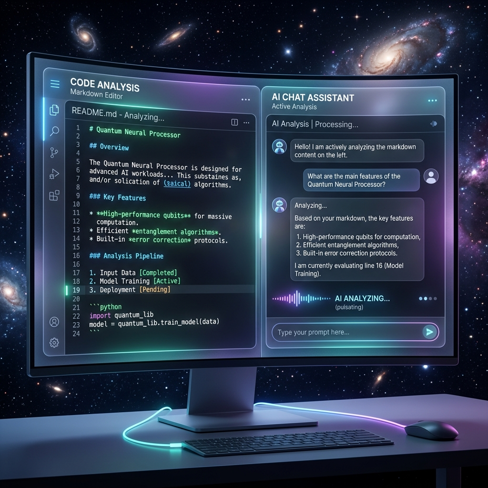
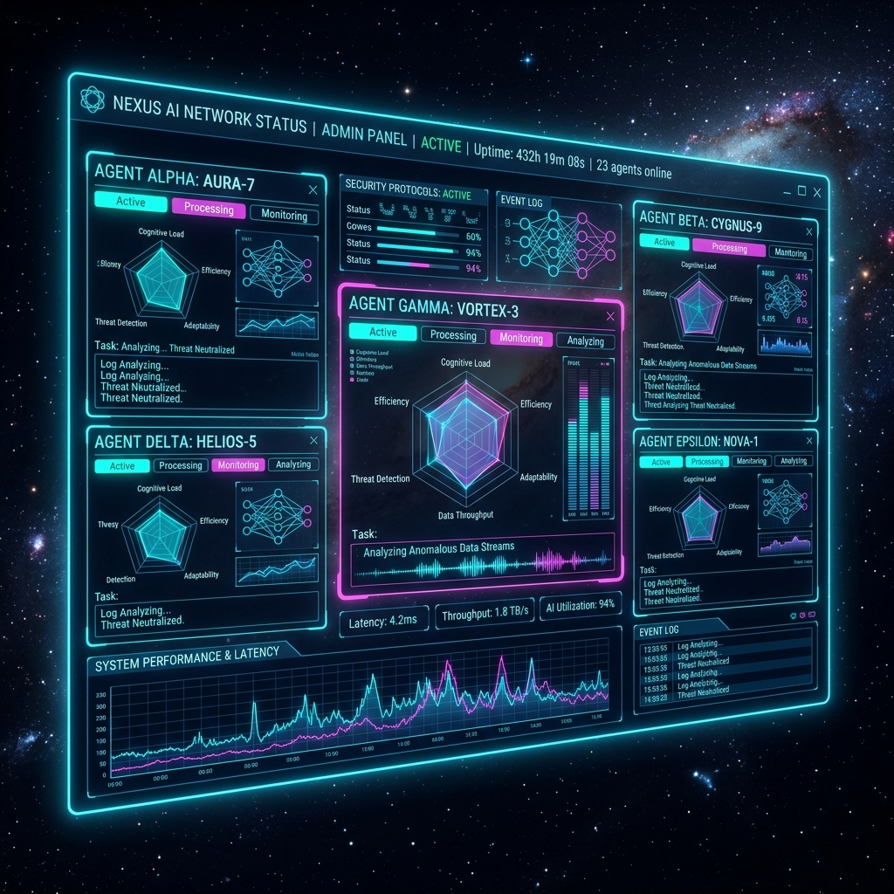
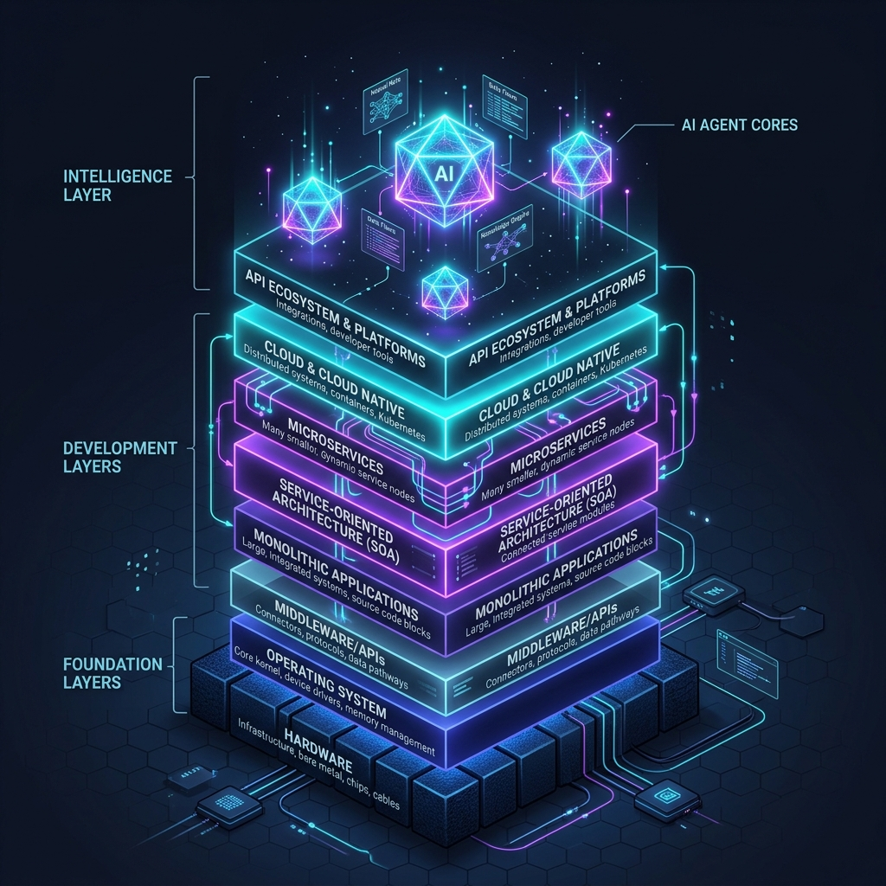

# MetaBlog - AI 驱动的智能博客系统

<p align="center">
  
</p>

<p align="center">
  <strong>从静态博客到智能 Agent 的进化之路</strong>
</p>

<p align="center">
  <a href="#功能特性">功能特性</a> •
  <a href="#快速开始">快速开始</a> •
  <a href="#架构设计">架构设计</a> •
  <a href="#开发路线图">开发路线图</a> •
  <a href="#贡献指南">贡献指南</a>
</p>

---

## 🎯 项目愿景

MetaBlog 不是一个普通的博客系统，它代表了内容管理系统向智能化 Agent 平台的演进：

| 层级 | 状态 | 描述 |
|------|------|------|
| **L1: 静态博客** | ✅ 已完成 | 基于 VitePress 的高性能博客，支持 Markdown、数学公式、代码高亮 |
| **L2: 内置 Chatbot** | ✅ 已完成 | 集成 DeepSeek AI，支持多轮对话、流式响应 |
| **L3: Agent 化** | ✅ 基本完成 | ChatBot Agent 化完成，能使用工具操作博客，实现热更新 |
| **L4: 自主 Agent** | 🚧 规划中 | Agent 面板支持定时任务、状态监听、自主执行 |
| **L5: Meta-Agent** | 🚧 规划中 | 能创建和配置其他 Agent 的超级 Agent |
| **L6: 状态监控** | 🚧 规划中 | 实时监控 Agent 运行状态（休眠/唤醒/执行中） |

<p align="center">
  <br>
  <strong>智能终端编辑模式 (L1 ~ L3)</strong><br>
  
  <br><br>
  <strong>Agent 控制中心与自治网络 (L4 ~ L6)</strong><br>
  
</p>

---

## 📊 当前进度 vs 最终目标

### ✅ 已实现（L3: Agent 化基本完成）

#### ChatBot Agent 化
- [x] AI 能识别何时需要调用工具
- [x] 支持 Function Calling 模式
- [x] 工具调用结果能正确返回给 AI
- [x] 多轮对话中保持工具上下文

#### 工具系统（41个工具）
- [x] 文章管理工具（6个）：CRUD 操作 + 搜索 + 列表
- [x] GitHub 工具（6个）：仓库、文件、提交、Issues、代码搜索
- [x] 知识库工具（7个）：KB 的 CRUD + 文档管理
- [x] 网络工具（2个）：`fetch_url`（通用 HTTP 代理）、`web_search`（DuckDuckGo 搜索）
- [x] 文件工具（3个）：read/write/list
- [x] 文本处理（4个）：摘要、格式化、翻译
- [x] 代码工具（2个）：执行代码、分析代码
- [x] 系统工具（4个）：时间、天气、计算、回声测试
- [x] 平台解析工具（4个）：知乎、小红书、微信、OCR
- [x] 笔记工具（2个）：创建笔记、列出笔记

#### Agent 管理
- [x] Agent 创建/编辑/删除
- [x] Agent 配置面板（模型、温度、系统提示词）
- [x] Skill 系统（预设能力组合）
- [x] Agent 切换和独立会话
- [x] 会话管理和历史记录

#### 工具测试平台
- [x] ToolTester.vue 可视化测试组件
- [x] 一键测试所有工具
- [x] 批量执行报告（成功率统计）

#### MCP 接入系统（新增）
- [x] 完整的 MCP Client/Manager 架构
- [x] 支持 HTTP/SSE/Stdio 传输协议
- [x] 20+ 预设 MCP 配置：
  - 代码平台：GitHub、GitLab、Bitbucket
  - 社交媒体：知乎、小红书、微博、Twitter
  - 开发工具：Puppeteer、Playwright、数据库、Docker、K8s
  - 生产力：Slack、Notion、Google Drive、Brave Search
- [x] MCPConfigPanel.vue 可视化管理面板
- [x] MCP 工具自动注册到 Agent 系统
- [x] 连接状态实时监控

---

### ⚠️ 当前存在的问题

#### 1. 工具功能不够完善
| 工具 | 问题 | 期望功能 |
|------|------|----------|
| `web_search` | ✅ 已接入 DuckDuckGo（零成本，免 API Key） | 支持 Tavily/Bing API 备选 |
| `get_weather` | 返回模拟数据 | 接入真实天气 API（和风/心知） |
| `execute_code` | 仅在浏览器执行 | 支持后端沙箱执行 Python/Node |
| `translate_text` | 依赖 AI 自身能力 | 接入翻译 API（DeepL/百度） |
| `analyze_code` | 简单规则分析 | 接入 ESLint/Prettier/静态分析 |
| `ocr_image` | 未实现真实 OCR | 接入 OCR 服务（百度/腾讯） |
| `fetch_url` | 仅支持简单 GET | 支持 JS 渲染、Cookie、代理 |

#### 2. 工具数量不足
**缺失的核心工具：**
- [ ] 数据库操作工具（SQLite/MySQL 查询）
- [ ] 图片处理工具（压缩、裁剪、水印）
- [ ] PDF 处理工具（读取、生成、合并）
- [ ] 邮件发送工具
- [ ] 日历/日程管理工具
- [ ] RSS 订阅工具
- [ ] 图表生成工具（Mermaid/图表）
- [ ] 版本控制工具（Git 操作）
- [ ] 部署工具（SSH/SCP/Docker）

#### 3. 工具实现存在缺陷
| 问题 | 影响 | 优先级 |
|------|------|--------|
| 部分工具使用 mock 数据 | AI 得到不准确信息 | 🔴 高 |
| 错误处理不够健壮 | 工具失败时用户体验差 | 🔴 高 |
| 工具参数验证不足 | 可能导致错误操作 | 🟡 中 |
| 工具返回格式不统一 | AI 解析困难 | 🟡 中 |
| 缺乏工具执行权限控制 | 安全风险 | 🟡 中 |

#### 4. Knowledge Base 局限
- [ ] 当前使用内存存储，重启数据丢失
- [ ] 需要持久化存储（IndexedDB/后端数据库）
- [ ] 缺乏向量搜索（相似度匹配）
- [ ] 不支持文档分块和嵌入
- [ ] 不支持多格式导入（PDF/Word/HTML）

---

### 🎯 与最终目标的差距

#### 当前状态（L3 基本完成）
```
✅ ChatBot 能使用工具
✅ 41 个基础工具
✅ Agent 配置管理
✅ 会话管理
⚠️  部分工具用 mock 数据
⚠️  工具功能和数量不足
```

#### 目标状态（L6 完成）
```
✅ 100+ 个高质量工具
✅ 所有工具接入真实服务
✅ 自主 Agent（定时任务 + 事件驱动）
✅ Agent 状态实时监控
✅ Meta-Agent 能创建其他 Agent
✅ 完整的权限和安全控制
```

#### 差距量化
| 维度 | 当前 | 目标 | 差距 |
|------|------|------|------|
| 工具数量 | 43 | 100+ | 还需 57+ |
| 真实数据工具 | ~65% | 100% | 还需完善 15 个 |
| 自主执行任务 | ❌ | ✅ | 需开发 L4 |
| Meta-Agent | ❌ | ✅ | 需开发 L5 |
| 状态监控 | ❌ | ✅ | 需开发 L6 |

---

### 🛠️ 近期优先修复（建议）

1. **修复 mock 数据工具**（1-2 周）
   - get_weather → 接入天气 API
   - ocr_image → 接入 OCR 服务
   - execute_code → 后端沙箱执行

2. **增强现有工具**（2-3 周）
   - fetch_url → 支持 JS 渲染
   - KB 系统 → 持久化存储
   - web_search → 多引擎切换（Tavily/Bing）

3. **飞书 CLI 集成**（已完成）
   - [x] `feishu_doc_create` 自动化权限下放
   - [x] `feishu_doc_append` 数学公式 ($latex$) 渲染支持
   - [x] `feishu_doc_update_block` 高级排版增强
   - [x] `feishu_im_send` 多接收者类型支持
   - [x] `feishu_user_search` 身份自动锁定 (OpenID)

4. **补充核心工具**（3-4 周）
   - 图片处理工具
   - PDF 处理工具
   - 数据库查询工具
   - Git 操作工具

---

## ✨ 功能特性

### 🤖 AI 助手系统

- **多轮对话**：支持上下文理解的多轮对话
- **流式响应**：实时显示 AI 回复，支持打字机效果
- **思考模式**：可展示 AI 的推理过程（Chain of Thought）
- **工具调用**：AI 可调用 41 种工具操作博客和外部资源
- **工具测试平台**：可视化测试所有工具，支持一键批量测试和报告生成

### 🛠️ 强大的工具系统（41个工具）

> ⚠️ **当前状态**：工具系统已完成基础架构，但部分工具仍使用 mock 数据，详见上方「当前进度 vs 最终目标」章节。

#### 文章管理工具（6个）
| 工具 | 功能 | 示例 |
|------|------|------|
| `get_article_content` | 读取文章内容，支持行范围 | `get_article_content(path="/sections/posts/hello", start_line=1, end_line=50)` |
| `search_articles` | 全文搜索，支持分类筛选 | `search_articles(query="Docker", section="knowledge")` |
| `list_articles` | 列出文章，支持递归浏览 | `list_articles(folder_path="/sections/knowledge/ml/")` |
| `create_article` | 创建文章，自动 frontmatter | `create_article(title="新文章", path="posts/article.md", tags=["AI"])` |
| `update_article` | 更新文章，支持追加/插入 | `update_article(path="...", content="...", mode="append")` |
| `delete_article` | 删除文章，支持备份 | `delete_article(path="...", confirm=true, backup_first=true)` |

#### GitHub 工具（6个）
| 工具 | 功能 |
|------|------|
| `github_get_repo` | 获取仓库信息、统计、README 预览 |
| `github_list_repo_contents` | 浏览目录结构 |
| `github_get_file_content` | 读取源码文件 |
| `github_search_code` | 搜索开源代码示例 |
| `github_get_commit_history` | 查看提交历史 |
| `github_get_issues` | 查看 Issues 和讨论 |

#### 网络工具
| 工具 | 功能 |
|------|------|
| `fetch_url` | 通用 HTTP 请求（GET/POST/PUT/DELETE），支持自定义 Header 和 Body，支持 HTML 文本提取 |
| `web_search` | 网络搜索（DuckDuckGo HTML 版，零成本，中文友好） |

#### 知识库工具（7个）
| 工具 | 功能 |
|------|------|
| `kb_list` | 列出所有知识库 |
| `kb_create` | 创建新知识库 |
| `kb_delete` | 删除知识库 |
| `kb_query` | 在知识库中搜索文档 |
| `kb_list_documents` | 列出知识库中的文档 |
| `kb_document_add` | 向知识库添加文档 |
| `kb_document_delete` | 从知识库删除文档 |

#### 其他工具
- **文件操作**：`read_file`, `write_file`, `list_files`
- **代码工具**：`execute_code`, `analyze_code`
- **文本处理**：`summarize_text`, `format_text`, `translate_text`
- **系统工具**：`get_current_time`, `get_weather`, `calculate`, `test_echo`
- **平台解析**：`parse_zhihu`, `parse_xiaohongshu`, `parse_wechat`, `ocr_image`

### 🎨 Skills 技能系统

AI 可以通过不同的 **Skills** 获得特定领域的能力：

| Skill | 描述 | 工具集 |
|-------|------|--------|
| 通用助手 | 默认对话模式 | 基础工具 |
| 写作专家 | 文章创作和编辑 | 文章管理 + 文本处理 |
| 编程助手 | 代码编写 + GitHub 集成 | 代码工具 + GitHub 全套 |
| 数据分析师 | 数据分析 + 报告生成 | 分析工具 + 文章管理 |
| 创意助手 | 头脑风暴 + 灵感记录 | 创意工具 + 知识管理 |

**内联编辑**：支持在模态框中直接编辑 Skill 的提示词和工具配置。

### 👤 Agent 控制中心

- **Agent 管理**：创建、编辑、删除 AI Agent
- **四种配置模式**：
  - 🔹 纯提示词模式：完全自定义角色
  - 🔹 纯技能模式：选择预设 Skill 组合
  - 🔹 纯工具模式：直接配置可用工具
  - 🔹 混合模式：技能 + 额外工具扩展
- **能力图谱**：可视化展示 Agent 的能力结构

### 💬 会话管理

- **会话列表**：按时间分组（今天/昨天/更早）
- **行内编辑**：直接在列表中重命名会话
- **删除确认**：美观的确认弹窗，避免误操作
- **消息版本**：支持重新生成并切换不同版本

### 🔌 MCP 外部工具接入

MCP (Model Context Protocol) 是 Anthropic 推出的开放协议，用于标准化 AI 与外部工具的交互。

#### 已集成的 MCP 预设（20+）

**代码平台**
| 平台 | 功能 | 配置方式 |
|------|------|----------|
| GitHub | Issues、PRs、仓库管理、代码搜索 | Personal Access Token |
| GitLab | 仓库、Issues、MR 管理 | Access Token + URL |
| Bitbucket | 代码仓库管理 | Access Token |

**社交媒体**
| 平台 | 功能 | 配置方式 |
|------|------|----------|
| 知乎 | 搜索问题、获取回答、收藏夹管理 | Cookie |
| 小红书 | 搜索笔记、获取详情、评论 | Cookie |
| 微博 | 搜索微博、用户信息、评论 | Cookie |
| Twitter/X | 推文搜索、用户信息 | Bearer Token |

**开发工具**
| 工具 | 功能 | 配置 |
|------|------|------|
| Puppeteer | 浏览器自动化、截图、PDF 生成 | 无需配置 |
| Playwright | 浏览器自动化测试 | 无需配置 |
| PostgreSQL | SQL 查询、数据库管理 | Database URL |
| SQLite | 本地数据库操作 | 文件路径 |
| Docker | 容器和镜像管理 | 无需配置 |
| Kubernetes | K8s 集群资源管理 | 无需配置 |
| Redis | 缓存数据操作 | Redis URL |

**生产力工具**
| 工具 | 功能 | 配置 |
|------|------|------|
| Slack | 发送消息、频道管理 | Bot Token |
| Notion | 页面和数据库管理 | Integration Token |
| Google Drive | 文件管理 | OAuth2 凭据 |
| Brave Search | 隐私搜索引擎 | API Key |
| Fetch | HTTP 请求 | 无需配置 |

#### 使用方法

```typescript
// 通过预设快速添加
import { mcpManager } from './core/mcp'

// 添加 GitHub MCP
await mcpManager.addServerFromPreset('github-official', {
  GITHUB_PERSONAL_ACCESS_TOKEN: 'ghp_xxxxx'
})

// 添加知乎 MCP
await mcpManager.addServerFromPreset('zhihu-mcp', {
  ZHIHU_COOKIE: 'your_cookie_here'
})

// 连接后工具自动注册到 Agent
// 工具名格式: {serverId}_{toolName}
// 例如: github-official_search_issues, zhihu-mcp_search_questions
```

#### MCP 配置面板

访问 `/chat` 页面的 MCP 面板，可以：
- 一键添加预设 MCP
- 查看连接状态和工具列表
- 管理多个 MCP 连接
- 导入/导出配置

---

## 🚀 快速开始

### 环境要求

- Node.js 18+
- npm 9+
- DeepSeek API Key（或其他兼容 OpenAI API 的服务）

### 安装

```bash
# 克隆仓库
git clone <repository-url>
cd MetaBlog

# 安装依赖
npm install

# 配置环境变量
cp .env.example .env
# 编辑 .env，添加你的 DeepSeek API Key
```

### 配置

编辑 `.env` 文件：

```env
# DeepSeek API Key（必填）
VITE_DEEPSEEK_API_KEY=your-api-key-here

# 可选：自定义 API 基础地址
VITE_DEEPSEEK_API_BASE=https://api.deepseek.com/v1
```

### 开发

```bash
# 启动开发服务器
npm run docs:dev

# 构建生产版本
npm run docs:build

# 预览生产版本
npm run docs:preview
```

### 访问

- 博客首页：`http://localhost:5173`
- AI 聊天：`http://localhost:5173/chat`

---

## 🏗️ 架构设计

<p align="center">
  <strong>系统演进架构 (L1-L6)</strong><br>
  
  <br><br>
  <strong>全域工具链与 MCP 拓扑网络</strong><br>
  
</p>

### 技术栈

| 层级 | 技术 |
|------|------|
| 前端框架 | Vue 3 + VitePress |
| 状态管理 | Vue Composition API + Refs |
| 样式 | Tailwind CSS + 自定义 CSS |
| AI 服务 | DeepSeek API (OpenAI 兼容) |
| 数据存储 | 文件系统 + 后端 API |
| 构建工具 | Vite |

### 核心模块

```
vitepress/theme/components/ai-chat/
├── core/
│   ├── composables/      # Vue 组合式函数
│   │   ├── useAIChat.ts      # AI 对话核心
│   │   ├── useAgentConfig.ts # Agent 配置
│   │   └── useSkills.ts      # Skills 管理
│   ├── services/         # 服务层
│   │   ├── aiService.ts      # AI API 调用
│   │   ├── agentStorage.ts   # Agent 数据持久化
│   │   └── sessionLogger.ts  # 会话日志
│   ├── tools/            # 工具系统
│   │   ├── definitions.ts    # 工具定义
│   │   ├── executors.ts      # 工具执行器
│   │   └── registry.ts       # 工具注册表
│   ├── skills/           # Skills 系统
│   │   └── registry.ts       # Skills 注册表
│   ├── mcp/              # MCP Server 实现
│   │   └── index.ts          # MCP 管理器
│   └── types/            # TypeScript 类型
├── modules/
│   ├── chat/             # 聊天模块
│   │   ├── session/      # 会话面板
│   │   ├── messages/     # 消息列表
│   │   ├── input/        # 输入框
│   │   └── settings/     # 设置面板
│   └── agent/            # Agent 模块
│       ├── admin/        # Agent 管理
│       └── skills/       # Skills 管理
├── layouts/              # 布局组件
└── ui/                   # UI 组件库
```

### 数据流

```
用户输入 → AI Service → 工具调用 → 文件系统/外部 API
                ↓
            流式响应 ← 结果处理 ← 工具执行结果
```

---

## 📋 开发路线图

### L4: 自主 Agent 面板（规划中）

**目标**：让 Agent 能够自主、定时或根据博客状态执行任务

**核心功能**：
- [ ] **任务调度器**：支持定时任务（Cron 表达式）
- [ ] **事件监听**：监听文件变化、博客状态变化
- [ ] **任务队列**：管理待执行、执行中、已完成的任务
- [ ] **通知系统**：任务完成后通知用户

**实现方案**：
1. 创建 `AgentScheduler` 服务
2. 集成 `node-cron` 或类似库实现定时任务
3. 添加文件系统监听器（chokidar）
4. 设计任务存储格式（JSON/YAML）

### L5: Meta-Agent（规划中）

**目标**：创建一个能创建和配置其他 Agent 的超级 Agent

**核心功能**：
- [ ] **Agent 工厂**：通过自然语言创建新 Agent
- [ ] **权限管理**：Meta-Agent 的权限控制
- [ ] **Skill 生成器**：自动生成 Skill 定义
- [ ] **Agent 市场**：导入/导出 Agent 配置

**实现方案**：
1. 扩展 Agent 配置面板，支持"创建 Agent"工具
2. 添加 `create_agent`, `update_agent_config` 等工具
3. 设计 Agent 模板系统
4. 实现 Agent 配置的导入导出

### L6: 状态监控（规划中）

**目标**：实时监控 Agent 的运行状态

**核心功能**：
- [ ] **状态指示器**：休眠 / 即将唤醒 / 执行中
- [ ] **执行日志**：查看 Agent 的执行历史
- [ ] **性能监控**：执行时间、成功率统计
- [ ] **异常告警**：执行失败时通知

**实现方案**：
1. 创建 `AgentMonitor` 组件
2. 设计状态机：idle → scheduled → running → completed/failed
3. 添加 WebSocket 或轮询机制更新状态
4. 实现可视化仪表板

---

## 🔧 高级配置

### 飞书 CLI 集成（进行中）

MetaBlog 通过后端执行 `lark-cli` 命令，让 Agent 直接操作飞书办公套件。

**前提**：本地安装并认证飞书 CLI
```powershell
# 安装
npm install -g @larksuite/cli --registry=https://registry.npmmirror.com

# 创建应用
lark-cli config init --new

# 用户授权（浏览器打开链接，扫码登录）
lark-cli auth login
```

**后续 Agent 可用命令**：
- `lark-cli im +messages-send --text "hello"`
- `lark-cli docs +create --title "周报" --markdown "# 进展"`
- `lark-cli calendar +agenda`

### 自定义工具

在 `src/theme/tools/<category>/` 中添加：

```typescript
// definitions.ts
export const myToolDef: ToolDefinition = {
  type: 'function',
  function: {
    name: 'my_tool',
    description: '我的自定义工具',
    parameters: {
      type: 'object',
      properties: {
        param1: { type: 'string' }
      },
      required: ['param1']
    }
  }
}

// executors.ts
export const myTool: ToolExecutor = async (args) => {
  const { param1 } = args
  // 实现工具逻辑
  return `结果: ${param1}`
}

// index.ts - 注册工具
{ name: 'my_tool', definition: myToolDef, executor: myTool }
```

### MCP Server 扩展

```typescript
import { MCPServer, mcpManager } from './core/mcp'

const myMCPServer = new MCPServer({
  name: 'my-server',
  version: '1.0.0',
  description: '我的 MCP Server'
})

myMCPServer.registerTool(
  'my_tool',
  {
    name: 'my_tool',
    description: '工具描述',
    parameters: { type: 'object', properties: {} }
  },
  async (args) => {
    return { result: 'success' }
  }
)

mcpManager.register('my-server', myMCPServer)
```

---

## 🐛 常见问题

### Q: AI 创建文章后显示 "Failed to fetch"
**A**: 这是请求体过大导致的。已修复，系统会自动截断过长的工具结果（>6000字符）。

### Q: 如何添加新的 LLM 提供商？
**A**: 修改 `aiService.ts` 中的 `API_BASE_URL` 和 `getApiKey()` 函数。

### Q: 工具调用失败怎么办？
**A**: 检查浏览器控制台的 Network 面板，查看 `/api/*` 端点的响应。

### Q: 如何备份博客数据？
**A**: 博客数据存储在 `docs/sections/` 目录下，直接备份该目录即可。

---

## 📄 许可证

MIT License

---

## 🙏 致谢

- [VitePress](https://vitepress.dev/) - 强大的静态站点生成器
- [DeepSeek](https://deepseek.com/) - 优秀的 AI 服务
- [Vue.js](https://vuejs.org/) - 渐进式前端框架

---

<p align="center">
  <strong>让 AI 成为博客的共创者，而不只是对话者</strong>
</p>
---

## 结尾：语义对照表

> 技术应当承载人文温度，以下是本项目使用的术语及其浪漫释义。

| 术语 | Term | 释义 |
|------|------|------|
| 部署 | Deploy | *让我们的代码抵达它该在的地方* |
| 量化 | Quantize | *在精度与空间的缝隙中寻找平衡* |
| 推理 | Inference | *模型在沉默中得出结论的时刻* |
| 微调 | Fine-tune | *用少量数据，唤醒模型的潜在记忆* |
| 显存 | VRAM | *承载着参数重量的数字海洋* |
| 迭代 | Iterate | *向着局部最优，不断攀登* |
| 星辰大海 | The Stars | *我们的未来是星辰大海* |

---

*愿你的代码如电路般精确，如诗歌般优雅。*
