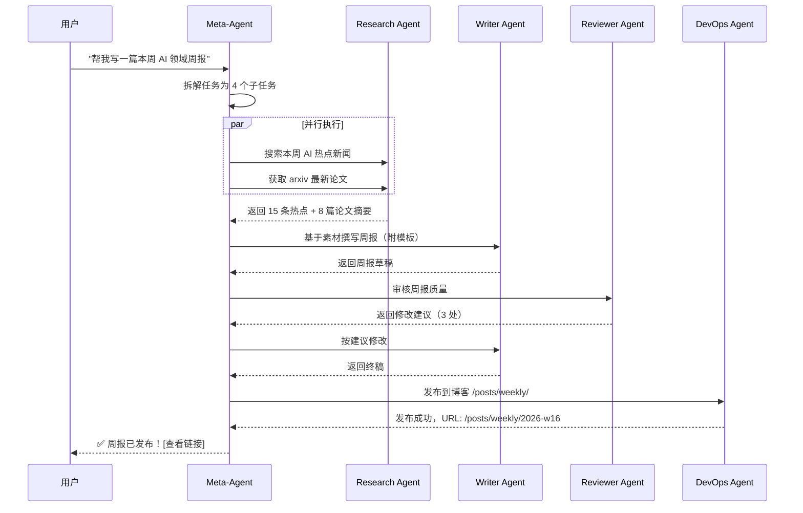

# Agent Swarm 架构设计

> 让 Agent 不再孤军奋战，而是以群体智能协作完成复杂任务。

<p align="center">
  
</p>

MetaBlog 的终极愿景是构建一个 **Agent Swarm（智能体蜂群）** 系统——多个专精 Agent 在 Meta-Agent 的调度下协同工作，像一个高效团队一样自主完成博客运营的全链路任务。

---

## 🧠 核心理念

### 为什么是 Swarm？

单个 Agent 的能力边界清晰：它只能做好一件事。而现实中的博客运营是一个 **多角色协作** 的过程：

| 角色 | 职责 | 对应 Agent |
|------|------|-----------|
| 选题策划 | 追踪热点、分析读者兴趣 | **Research Agent** |
| 内容创作 | 撰写文章、生成代码示例 | **Writer Agent** |
| 质量审核 | 校对语法、检查技术准确性 | **Reviewer Agent** |
| SEO 优化 | 关键词分析、元数据优化 | **SEO Agent** |
| 运维部署 | 构建、发布、监控 | **DevOps Agent** |
| 数据分析 | 流量统计、内容效果评估 | **Analytics Agent** |

**Swarm 架构的核心优势**：

- **专精化**：每个 Agent 专注于一个领域，系统提示词更精确
- **可扩展**：新增能力只需注册一个新 Agent
- **容错性**：单个 Agent 失败不影响整体系统
- **并行化**：多个 Agent 可同时执行独立任务

---

## 🏗️ 架构概览

<p align="center">
  
</p>

### 三层架构

```
┌─────────────────────────────────────────────┐
│              Meta-Agent (调度层)              │
│  ┌─────────┐ ┌──────────┐ ┌──────────────┐  │
│  │ Planner │ │ Allocator│ │ Supervisor   │  │
│  └─────────┘ └──────────┘ └──────────────┘  │
├─────────────────────────────────────────────┤
│           Specialist Agents (执行层)          │
│  ┌────────┐ ┌────────┐ ┌────────┐ ┌──────┐  │
│  │Writer  │ │Research│ │Reviewer│ │ SEO  │  │
│  │Agent   │ │ Agent  │ │ Agent  │ │Agent │  │
│  └────────┘ └────────┘ └────────┘ └──────┘  │
├─────────────────────────────────────────────┤
│          Shared Infrastructure (基础层)       │
│  ┌──────────┐ ┌──────────┐ ┌─────────────┐  │
│  │Tool      │ │Message   │ │Shared       │  │
│  │Registry  │ │Bus       │ │Memory       │  │
│  └──────────┘ └──────────┘ └─────────────┘  │
└─────────────────────────────────────────────┘
```

### 组件说明

#### 调度层 — Meta-Agent

Meta-Agent 是 Swarm 的大脑，负责：

- **Planner（规划器）**：将用户的高层意图分解为可执行的子任务
- **Allocator（分配器）**：根据 Agent 能力和负载状态分配任务
- **Supervisor（监管者）**：监控执行进度，处理异常和重试

#### 执行层 — Specialist Agents

每个 Specialist Agent 具备：

- 独立的 System Prompt（领域知识注入）
- 专属的 Tool Set（只暴露必要工具）
- 独立的 Memory Context（会话上下文隔离）
- 状态上报机制（向 Meta-Agent 汇报进度）

#### 基础层 — Shared Infrastructure

- **Tool Registry**：统一管理 100+ 工具的注册、鉴权、限流
- **Message Bus**：Agent 间的异步通信通道
- **Shared Memory**：跨 Agent 的共享知识（如文章列表缓存、用户偏好）

---

## 🔄 协作流程

<p align="center">
  
</p>

### 典型场景：自动化周报生成



### 任务分解策略

Meta-Agent 使用 **DAG（有向无环图）** 来管理任务依赖：

```typescript
interface SwarmTask {
  id: string
  type: 'research' | 'write' | 'review' | 'deploy' | 'analyze'
  assignee: AgentId
  dependencies: TaskId[]       // 前置任务
  status: 'pending' | 'running' | 'completed' | 'failed'
  retryCount: number
  maxRetries: number
  result?: unknown
  createdAt: Date
  completedAt?: Date
}

interface TaskDAG {
  tasks: Map<TaskId, SwarmTask>
  execute(): AsyncGenerator<TaskResult>
}
```

---

## 🐝 Agent 生命周期

<p align="center">
  
</p>

### 六阶段模型

| 阶段 | 状态 | 描述 | 触发条件 |
|------|------|------|----------|
| **Spawn** | `spawning` | 创建 Agent 实例 | Meta-Agent 分配任务 |
| **Configure** | `configuring` | 注入 prompt + 分配工具 | Spawn 完成 |
| **Execute** | `executing` | 执行具体任务 | Configure 完成 |
| **Collaborate** | `collaborating` | 与其他 Agent 交换信息 | 需要跨 Agent 数据 |
| **Report** | `reporting` | 上报结果给 Meta-Agent | 任务完成 |
| **Sleep** | `idle` | 休眠/释放资源 | Report 完成 |

### 状态机实现

```typescript
type AgentState = 
  | 'idle' 
  | 'spawning' 
  | 'configuring' 
  | 'executing' 
  | 'collaborating' 
  | 'reporting' 
  | 'failed'

interface AgentStateMachine {
  currentState: AgentState
  transition(event: AgentEvent): AgentState
  onEnter(state: AgentState, callback: () => void): void
  onExit(state: AgentState, callback: () => void): void
}

const VALID_TRANSITIONS: Record<AgentState, AgentState[]> = {
  idle:          ['spawning'],
  spawning:      ['configuring', 'failed'],
  configuring:   ['executing', 'failed'],
  executing:     ['collaborating', 'reporting', 'failed'],
  collaborating: ['executing', 'reporting', 'failed'],
  reporting:     ['idle', 'failed'],
  failed:        ['idle', 'spawning'],  // 允许重试
}
```

---

## 📡 通信协议

### Agent 间消息格式

```typescript
interface SwarmMessage {
  id: string
  from: AgentId
  to: AgentId | 'broadcast'      // 支持广播
  type: 'request' | 'response' | 'event' | 'error'
  topic: string                   // 消息主题，如 'task.result'
  payload: unknown
  timestamp: Date
  correlationId?: string          // 关联请求-响应对
  ttl?: number                    // 消息过期时间（ms）
}
```

### Message Bus 实现

```typescript
class SwarmMessageBus {
  private subscribers: Map<string, Set<MessageHandler>>

  /** 发布消息到指定主题 */
  publish(topic: string, message: SwarmMessage): void

  /** 订阅主题 */
  subscribe(topic: string, handler: MessageHandler): Unsubscribe

  /** 请求-响应模式（带超时） */
  request(
    to: AgentId, 
    payload: unknown, 
    timeoutMs: number
  ): Promise<SwarmMessage>
}
```

### 三种通信模式

| 模式 | 使用场景 | 示例 |
|------|----------|------|
| **Request-Response** | 同步任务委派 | Meta-Agent → Writer Agent: "写一篇文章" |
| **Publish-Subscribe** | 事件广播 | Research Agent → all: "发现了新热点" |
| **Pipeline** | 链式处理 | Research → Writer → Reviewer → Deploy |

---

## 🧩 预设 Agent 蓝图

### Writer Agent（创作者）

```yaml
name: writer-agent
role: 内容创作专家
model: deepseek-chat
temperature: 0.7
tools:
  - create_article
  - update_article
  - format_text
  - summarize_text
  - translate_text
system_prompt: |
  你是一位资深技术博客作者。你擅长用简洁清晰的语言
  将复杂技术概念解释给读者。你的文章风格：
  - 开头引人入胜，先说"为什么"
  - 代码示例简洁且可运行
  - 每篇文章都有清晰的 TL;DR
```

### Research Agent（研究员）

```yaml
name: research-agent
role: 信息搜索与分析专家
model: deepseek-chat
temperature: 0.3
tools:
  - web_search
  - fetch_url
  - github_search_code
  - github_get_repo
  - parse_zhihu
  - parse_xiaohongshu
  - kb_query
system_prompt: |
  你是一位高效的技术研究员。你的职责是搜索、筛选、
  汇总信息。输出要求：
  - 区分事实与观点
  - 标注信息来源
  - 按相关性排序
  - 给出置信度评估
```

### Reviewer Agent（审稿人）

```yaml
name: reviewer-agent
role: 内容质量审核
model: deepseek-chat
temperature: 0.2
tools:
  - get_article_content
  - analyze_code
  - search_articles
system_prompt: |
  你是一位严谨的技术审稿人。检查要点：
  - 技术准确性（代码能否运行？逻辑是否正确？）
  - 行文质量（是否通顺？有无错别字？）
  - SEO 友好度（标题、描述、关键词）
  - 返回结构化的审核报告
```

### DevOps Agent（运维）

```yaml
name: devops-agent
role: 构建与部署
model: deepseek-chat
temperature: 0.1
tools:
  - execute_code
  - read_file
  - write_file
  - list_files
system_prompt: |
  你是 MetaBlog 的 DevOps 工程师。你负责：
  - 执行 VitePress 构建
  - 检查构建产物
  - 管理文件系统
  - 报告部署状态
```

---

## 📈 实施路线

### Phase 1: 基础通信 (L4 前半)

- [ ] 实现 `SwarmMessageBus`
- [ ] 定义 `SwarmMessage` 类型和序列化
- [ ] Agent 状态机 (`AgentStateMachine`)
- [ ] 基础的双 Agent 通信测试

### Phase 2: Meta-Agent 调度 (L4 后半)

- [ ] 实现 `TaskDAG` 任务图
- [ ] Meta-Agent Planner（LLM 驱动的任务分解）
- [ ] Allocator（基于 Skill 匹配的任务分配）
- [ ] Supervisor（进度监控 + 超时重试）

### Phase 3: Specialist Agents (L5)

- [ ] 实现 4 个核心 Specialist Agent
- [ ] Agent 蓝图（Blueprint）系统
- [ ] Agent 动态创建与销毁
- [ ] 跨 Agent 共享 Memory

### Phase 4: 监控与优化 (L6)

- [ ] Swarm Dashboard（实时状态看板）
- [ ] Agent 性能指标收集
- [ ] 自适应负载均衡
- [ ] 执行日志与回放

---

## 🔬 技术决策记录

### Q: 为什么不用 LangGraph / CrewAI？

MetaBlog 选择自建 Swarm 框架而非使用现成库，原因是：

1. **深度集成**：需要与 VitePress 文件系统、MCP 协议深度绑定
2. **轻量化**：不需要 LangChain 的完整抽象层，只需核心调度逻辑
3. **学习价值**：作为技术博客项目，自建框架本身就是最好的教学内容
4. **定制性**：Agent 间通信需要适配前端 Vue 响应式系统

### Q: Agent 间通信用 WebSocket 还是内存？

当前阶段使用 **内存级 EventEmitter**，原因是：
- 所有 Agent 运行在同一 Node.js 进程
- 无需网络序列化开销
- 未来扩展到分布式时再升级为 WebSocket/Redis Pub-Sub

---

## 📚 相关资料

- [OpenAI Swarm](https://github.com/openai/swarm) — 轻量级多 Agent 框架
- [AutoGen](https://github.com/microsoft/autogen) — 微软多 Agent 对话框架
- [CrewAI](https://github.com/joaomdmoura/crewAI) — 角色扮演式 Agent 协作
- [MetaGPT](https://github.com/geekan/MetaGPT) — 模拟软件公司的多 Agent 系统

---

> *Swarm — 群体的智慧，远大于个体的总和。*
>
> *当 Agent 学会协作，博客就不再只是记录的工具，*
> *而成为一个有生命力的内容生态。*

---

| 术语 | Term | 释义 |
|------|------|------|
| 蜂群 | Swarm | *个体微小，群体伟大* |
| 调度 | Orchestrate | *让每个音符都在正确的时刻响起* |
| 协作 | Collaborate | *我完成我擅长的，你完成你擅长的* |
| 消息总线 | Message Bus | *Agent 之间无声的语言通道* |
| 生命周期 | Lifecycle | *从诞生到沉睡，每一步都有意义* |
| 蓝图 | Blueprint | *Agent 的基因图谱* |
