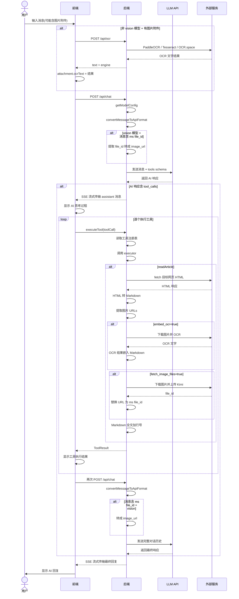
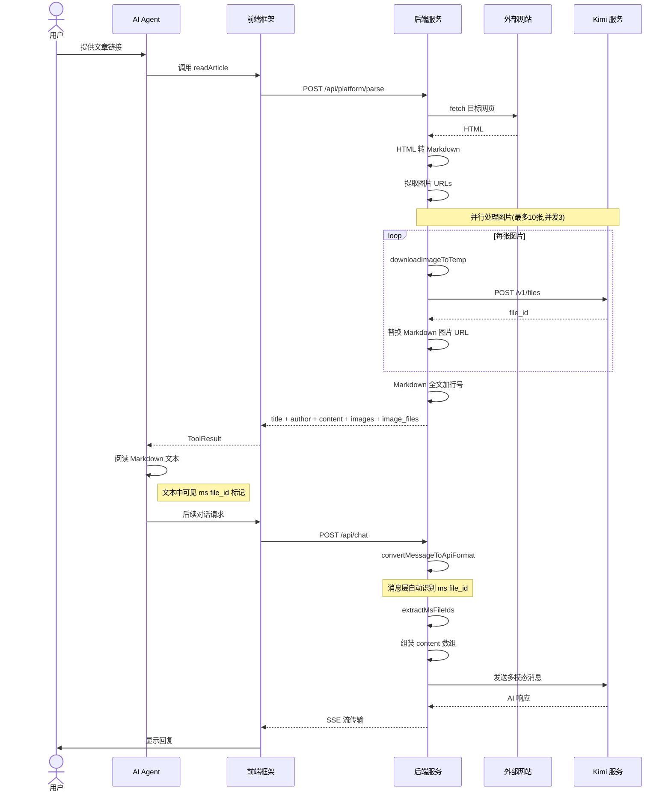
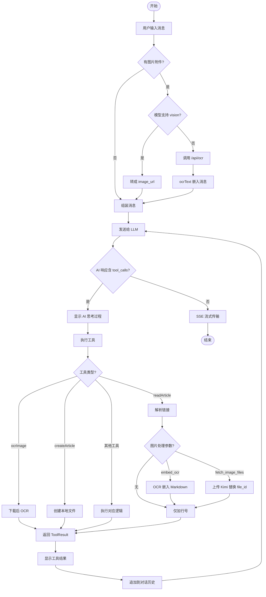
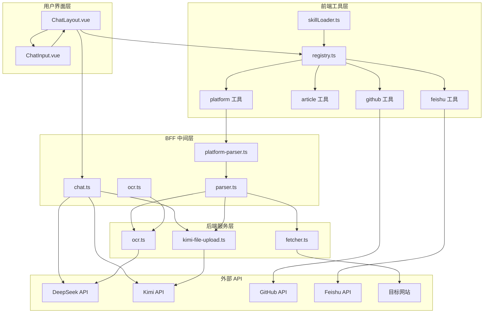
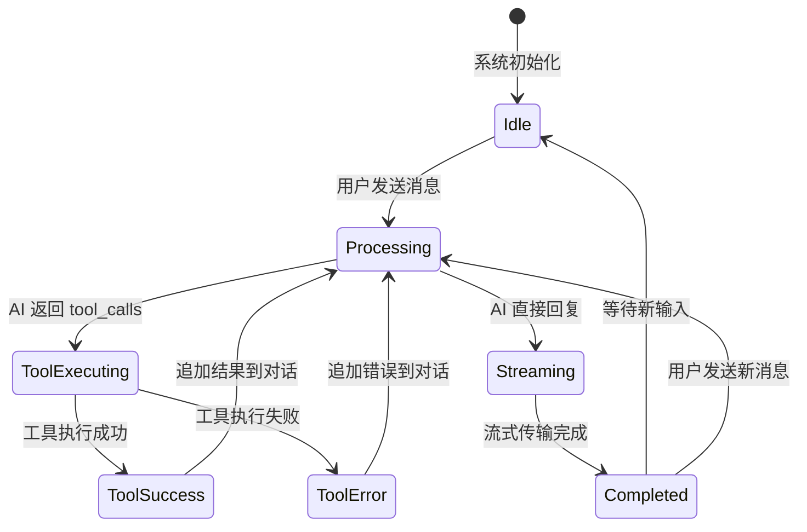
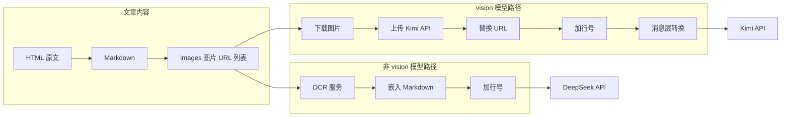
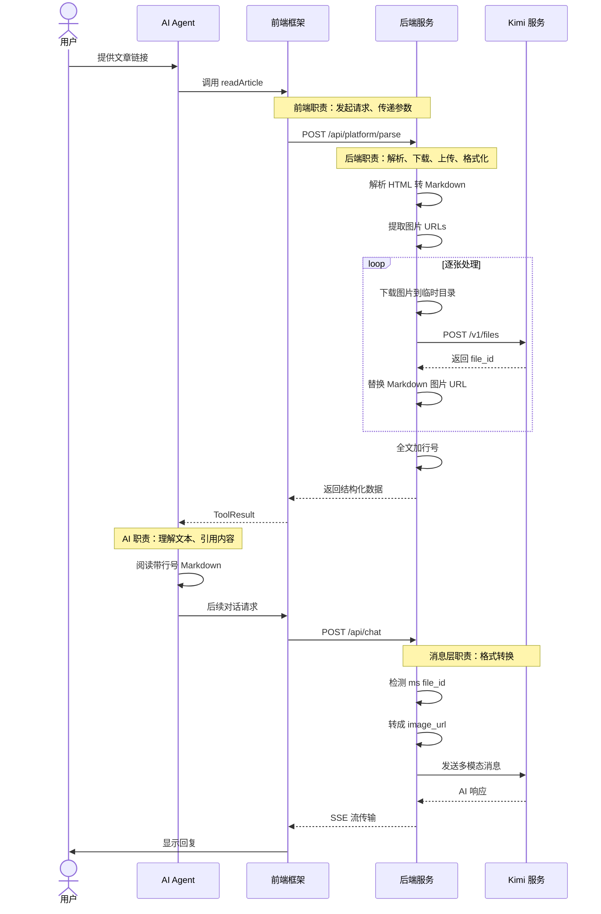

# Agent 工具调用交互图

本文档用 UML 图完整描述 MetaBlog 中 AI Agent 调用工具的全流程,涵盖从用户输入到工具执行、再到结果返回的各个环节. 

---

## 一、完整时序图：从用户输入到 AI 回复

### 关键步骤说明

| 阶段 | 说明 |
|------|------|
| 附件预处理 | 非 vision 模型自动 OCR 图片附件,vision 模型跳过 |
| 消息转换 | 根据模型能力转换消息格式(纯文本 / vision 多模态) |
| AI 决策 | LLM 决定直接回复或调用工具 |
| 工具执行 | 前端执行工具,后端处理平台解析、OCR、文件上传等 |
| 结果回传 | 工具结果追加到对话,再次请求 LLM 生成最终回复 |

---

## 二、核心流程时序图：多模态文章解析

### 两种模型路径对比

| 模型类型 | 参数 | 后端动作 | AI 看到的内容 |
|----------|------|----------|---------------|
| 非 vision (DeepSeek) | embed_ocr=true | 下载图片 - OCR - 文字嵌入 Markdown | 带行号的 Markdown + 图片 OCR 引用块 |
| vision (Kimi) | fetch_image_files=true | 下载图片 - 上传 Kimi - 替换为 ms file_id | 带行号的 Markdown + 原图(通过 ms file_id) |

---

## 三、活动图：工具调用决策流程

---

## 四、组件图：工具系统架构

---

## 五、状态图：工具调用生命周期

---

## 六、数据流图：图片处理的两种路径

---

## 七、泳道图：多模态文章解析各角色职责

---

## 总结

本文档用 7 种 UML 图完整覆盖了 Agent 工具调用的各个环节：

| 图表类型 | 说明 | 重点关注 |
|----------|------|----------|
| 完整时序图 | 从用户输入到 AI 回复的全链路 | 附件预处理、消息转换、工具执行循环 |
| 核心流程时序图 | 多模态文章解析的详细步骤 | ms file_id 的生成与消费 |
| 活动图 | 工具调用的决策分支 | 模型类型判断、参数选择 |
| 组件图 | 系统分层架构 | 前端、后端、外部服务的职责边界 |
| 状态图 | 工具调用的生命周期 | 状态转换条件 |
| 数据流图 | 图片处理的两种路径 | OCR vs file_id 的对比 |
| 泳道图 | 各角色的职责划分 | 用户、AI、前端、后端、Kimi 的分工 |
