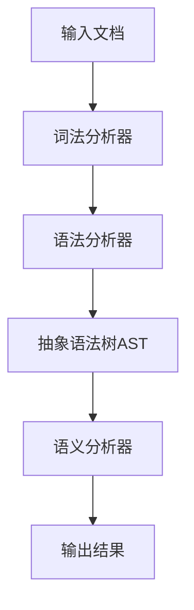

title: MLA解析技术详解
date: 2024-12-01
tags: [技术, 解析, MLA, 数据格式]
category: 技术知识
---

# MLA解析技术详解

## 什么是MLA？

MLA（Markup Language Analysis）是一种标记语言解析技术，主要用于处理和分析各种标记语言文档，如XML、HTML、Markdown等。它提供了一套完整的解析、转换和验证工具链。

## MLA解析的核心特性

### 1. 多格式支持
MLA解析器支持多种标记语言格式：
- XML/HTML解析
- Markdown解析
- JSON解析
- YAML解析

### 2. 高性能解析
采用流式解析技术，能够高效处理大型文档：
- 内存占用低
- 解析速度快
- 支持增量解析

### 3. 灵活的扩展机制
MLA提供了丰富的扩展接口：
- 自定义解析器插件
- 转换器扩展
- 验证规则定义

## MLA解析器架构

### 核心组件



### 解析流程

1. **词法分析（Lexical Analysis）**
   - 将原始文本转换为标记（Tokens）
   - 识别标签、属性、文本内容

2. **语法分析（Syntax Analysis）**
   - 构建语法树结构
   - 验证语法正确性

3. **语义分析（Semantic Analysis）**
   - 检查语义约束
   - 应用业务规则

4. **输出生成**
   - 生成目标格式
   - 应用转换规则

## 使用示例

### 基本用法

```python
from mla_parser import MLAParser

# 创建解析器实例
parser = MLAParser()

# 解析XML文档
xml_doc = """
<book>
  <title>MLA解析指南</title>
  <author>技术团队</author>
</book>
"""

result = parser.parse(xml_doc, format='xml')
print(result.ast)  # 输出抽象语法树
```

### 高级功能

```python
# 自定义解析规则
class CustomParser(MLAParser):
    def handle_element(self, element):
        # 自定义元素处理逻辑
        if element.tag == 'custom':
            return self.process_custom(element)
        return super().handle_element(element)

# 使用转换器
transformer = MLATransformer()
transformer.add_rule('xml', 'json', xml_to_json_converter)
result = transformer.transform(xml_doc, 'xml', 'json')
```

## 应用场景

### 1. 文档处理
- 批量文档转换
- 格式标准化
- 内容提取

### 2. 数据集成
- 异构数据源整合
- 格式转换
- 数据清洗

### 3. 内容管理
- 静态网站生成
- 文档自动化处理
- 内容发布

## 性能优化技巧

### 1. 缓存策略
```python
# 启用解析缓存
parser.enable_cache(max_size=1000)
```

### 2. 并行处理
```python
# 使用多线程解析
from concurrent.futures import ThreadPoolExecutor

with ThreadPoolExecutor(max_workers=4) as executor:
    results = list(executor.map(parser.parse, documents))
```

### 3. 增量解析
```python
# 流式解析大型文档
stream_parser = MLAStreamParser()
for chunk in read_large_file():
    stream_parser.feed(chunk)
result = stream_parser.close()
```

## 最佳实践

### 1. 错误处理
```python
try:
    result = parser.parse(content)
except MLA.ParseError as e:
    logger.error(f"解析失败: {e}")
    # 优雅降级处理
    result = fallback_parse(content)
```

### 2. 内存管理
```python
# 及时释放资源
with MLAParser() as parser:
    result = parser.parse(content)
# 解析器自动清理
```

### 3. 配置优化
```python
# 根据文档类型调整配置
config = {
    'max_depth': 100,
    'strict_mode': False,
    'preserve_whitespace': True
}
parser.configure(config)
```

## 常见问题与解决方案

### Q1: 如何处理不规范的标记语言？
**解决方案**：
- 启用容错模式
- 使用预处理清洗工具
- 自定义修复规则

### Q2: 解析性能瓶颈在哪里？
**诊断方法**：
- 使用性能分析工具
- 监控内存使用
- 分析CPU时间分布

### Q3: 如何扩展新的格式支持？
**扩展步骤**：
1. 实现词法分析器
2. 定义语法规则
3. 注册到MLA框架

## 总结

MLA解析技术为标记语言处理提供了强大的工具集。通过合理的架构设计和优化策略，可以高效处理各种复杂的文档解析任务。无论是简单的格式转换，还是复杂的内容提取，MLA都能提供可靠的解决方案。

## 参考资料

1. MLA官方文档
2. 标记语言解析原理
3. 编译原理相关技术
4. 实际项目应用案例

---

*本文最后更新于 2024年12月1日*

---
创建于: 2026/4/16 20:20:13
