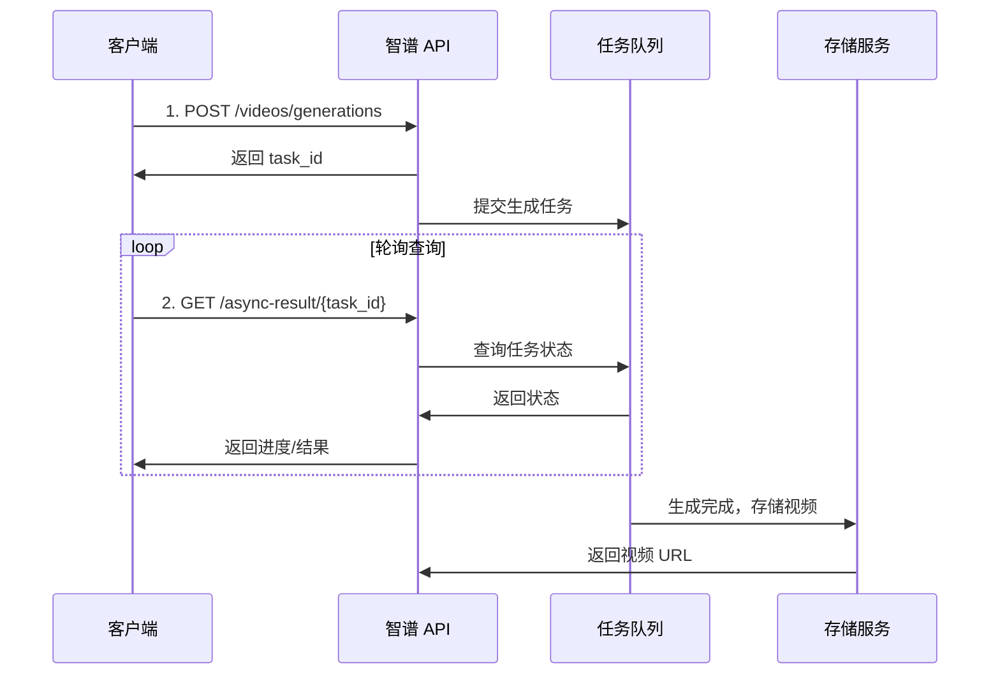

# 视频生成 (Video Generation)

## 1. 功能介绍

视频生成是智谱 AI 提供的异步视频生成服务，支持根据文本描述或首帧图片生成高质量视频内容。该服务采用异步任务模式，用户提交生成任务后，通过轮询方式获取最终结果。

**核心能力：**
- **文生视频**：根据文本描述生成动态视频
- **图生视频**：基于首帧图片延续生成视频
- **AI 音效**：自动生成与画面匹配的声音效果
- **高清画质**：支持 4K 分辨率输出

**支持的模型：**

| 模型 | 模型代码 | 类型 | 规格 | 特点 |
|:---|:---|:---|:---|:---|
| CogVideoX-Flash | cogvideox-flash | 视频生成 | 4K/10秒/60fps | AI音效、高清、免费 |

> **注意**：CogVideoX-Flash 是独立的视频生成模型，不属于对话模型，不支持思考模式和思维链。使用专门的 `/videos/generations` 端点。

---

## 2. 适用场景

| 场景 | 说明 | 示例提示词 |
|:---|:---|:---|
| **短视频创作** | 快速生成社交媒体短视频内容 | "一只可爱的柴犬在樱花树下追逐蝴蝶，阳光透过花瓣洒落" |
| **广告创意** | 产品展示和品牌宣传视频 | "一瓶香水在水晶桌面上，周围环绕着梦幻的花瓣和光晕" |
| **教育培训** | 教学演示和概念可视化 | "DNA 双螺旋结构在显微镜下缓缓旋转，展示生命科学的奥秘" |
| **游戏动画** | 游戏场景和角色动画预览 | "科幻城市夜景，飞行器穿梭在高楼之间，霓虹灯光闪烁" |
| **艺术创作** | 数字艺术和实验性视频 | "水墨画风格的山水，云雾缭绕，飞鸟掠过湖面" |

---

## 3. 视频规格说明

### 3.1 技术规格

| 规格项 | 参数值 | 说明 |
|:---|:---|:---|
| **分辨率** | 4K (3840×2160) | 超高清画质输出 |
| **时长** | 10 秒 | 单视频固定时长 |
| **帧率** | 60 fps | 流畅的动态效果 |
| **音效** | AI 自动生成 | 智能匹配画面氛围 |
| **格式** | MP4 | 通用视频格式 |

### 3.2 模型信息

| 模型名称 | 模型代码 | 类型 | 思考模式 | 思维链 |
|:---|:---|:---|:---:|:---:|
| **CogVideoX-Flash** | `cogvideox-flash` | 视频生成 | N/A | N/A |

> **说明**：CogVideoX-Flash 是专门的视频生成模型，不属于对话模型，不支持思考模式和思维链。

---

## 4. 异步调用流程详解

视频生成采用异步任务模式，完整的调用流程如下：



### 4.1 流程步骤

1. **提交任务**：调用 `POST /videos/generations` 提交生成请求
2. **获取任务ID**：API 返回 `task_id` 用于后续查询
3. **轮询查询**：使用 `GET /async-result/{task_id}` 定期查询任务状态
4. **获取结果**：任务完成后，API 返回视频下载 URL

### 4.2 任务状态

| 状态 | 说明 | 处理方式 |
|:---|:---|:---|
| `PROCESSING` | 处理中 | 继续轮询 |
| `SUCCESS` | 成功 | 获取视频 URL |
| `FAIL` | 失败 | 查看错误信息 |

---

## 5. API 调用方式

### 5.1 提交生成任务

**端点：** `POST https://open.bigmodel.cn/api/paas/v4/videos/generations`

**请求头：**
```http
Content-Type: application/json
Authorization: Bearer {API_KEY}
```

**请求体（文生视频）：**
```json
{
  "model": "cogvideox-flash",
  "prompt": "一只可爱的熊猫在竹林中吃竹子",
  "size": "3840x2160"
}
```

**请求体（图生视频）：**
```json
{
  "model": "cogvideox-flash",
  "prompt": "熊猫缓缓抬起头，环顾四周",
  "image_url": "https://example.com/panda.jpg",
  "size": "3840x2160"
}
```

**响应示例：**
```json
{
  "request_id": "req_1234567890",
  "id": "task_xxxxxxxxxx",
  "model": "cogvideox-flash",
  "task_status": "PROCESSING"
}
```

### 5.2 查询任务结果

**端点：** `GET https://open.bigmodel.cn/api/paas/v4/async-result/{task_id}`

**请求头：**
```http
Authorization: Bearer {API_KEY}
```

**响应示例（处理中）：**
```json
{
  "request_id": "req_1234567890",
  "id": "task_xxxxxxxxxx",
  "task_status": "PROCESSING",
  "model": "cogvideox-flash"
}
```

**响应示例（成功）：**
```json
{
  "request_id": "req_1234567890",
  "id": "task_xxxxxxxxxx",
  "task_status": "SUCCESS",
  "model": "cogvideox-flash",
  "video_result": [
    {
      "url": "https://example.com/video.mp4",
      "cover_image_url": "https://example.com/cover.jpg"
    }
  ]
}
```

---

## 6. 参数说明

### 6.1 提交任务参数

| 参数 | 类型 | 必填 | 说明 |
|:---|:---|:---:|:---|
| `model` | string | ✓ | 模型代码，固定为 `cogvideox-flash` |
| `prompt` | string | ✓ | 视频描述提示词，建议 100-500 字 |
| `image_url` | string | ✗ | 首帧图片 URL（图生视频时使用） |
| `size` | string | ✗ | 分辨率，默认 `3840x2160` |

### 6.2 提示词参数建议

| 参数 | 推荐值 | 说明 |
|:---|:---|:---|
| 提示词长度 | 100-500 字符 | 描述越详细，效果越好 |
| 场景描述 | 包含时间、地点、主体 | "清晨的森林里，阳光透过树叶..." |
| 动作描述 | 明确主体动作 | "小鸟展翅飞翔，羽毛随风飘动" |
| 氛围描述 | 光线、色彩、情绪 | "温暖的金色阳光，宁静祥和的氛围" |

### 6.3 响应参数

| 参数 | 类型 | 说明 |
|:---|:---|:---|
| `request_id` | string | 请求唯一标识 |
| `id` | string | 任务 ID，用于查询结果 |
| `task_status` | string | 任务状态：PROCESSING/SUCCESS/FAIL |
| `video_result` | array | 视频结果列表（成功时返回） |
| `url` | string | 视频下载地址 |
| `cover_image_url` | string | 视频封面图片地址 |

---

## 7. 提示词编写建议

### 7.1 提示词结构

推荐按照以下结构组织提示词：

```
[场景设定] + [主体描述] + [动作细节] + [视觉风格] + [氛围/情绪]
```

### 7.2 优秀提示词示例

**动物场景：**
```
一只橘色的小猫在午后的窗台上慵懒地伸懒腰，阳光透过白色纱帘
洒在它柔软的毛发上，形成温暖的光晕。微风吹动窗帘，小猫的
胡须轻轻颤动，它眯起眼睛，享受这宁静的时光。
```

**自然风景：**
```
清晨的迷雾森林，阳光穿透层层叠叠的树冠，形成金色的光束。
地面上覆盖着厚厚的苔藓和野花，一只鹿从雾中缓缓走出，低头
饮水，水面泛起涟漪，倒映着梦幻般的晨光。
```

**城市景观：**
```
未来主义城市夜景，摩天大楼之间穿梭着流线型的飞行汽车，
建筑表面覆盖着动态全息广告和霓虹灯带。雨滴落在透明玻璃
幕墙上，折射出五光十色的光芒，营造出赛博朋克的氛围。
```

**图生视频：**
```
画面中的主体缓缓动起来，背景元素逐渐活跃，光线发生微妙变化，
营造出时间流逝的感觉。保持原有构图和色调，增加自然的动态效果。
```

### 7.3 提示词优化技巧

| 技巧 | 说明 | 示例 |
|:---|:---|:---|
| 具体化 | 使用具体名词而非抽象概念 | 用"金毛犬"代替"狗" |
| 感官描述 | 加入视觉、听觉元素 | "波光粼粼的水面，潺潺流水声" |
| 光影细节 | 描述光源和阴影 | "逆光下的剪影，柔和的侧光" |
| 动态范围 | 描述动作的连续变化 | "花瓣从飘落、旋转到落地" |

---

## 8. 完整代码示例

### 8.1 Python 实现

```python
import os
import time
import requests
from typing import Optional, Dict, Any


class ZhipuVideoGenerator:
    """智谱视频生成器"""
    
    def __init__(self, api_key: str):
        self.api_key = api_key
        self.base_url = "https://open.bigmodel.cn/api/paas/v4"
        self.headers = {
            "Authorization": f"Bearer {api_key}",
            "Content-Type": "application/json"
        }
    
    def submit_task(
        self, 
        prompt: str, 
        image_url: Optional[str] = None,
        size: str = "3840x2160"
    ) -> Dict[str, Any]:
        """
        提交视频生成任务
        
        Args:
            prompt: 视频描述提示词
            image_url: 首帧图片 URL（图生视频时使用）
            size: 分辨率，默认 3840x2160
        
        Returns:
            包含 task_id 的响应数据
        """
        url = f"{self.base_url}/videos/generations"
        
        payload = {
            "model": "cogvideox-flash",
            "prompt": prompt,
            "size": size
        }
        
        if image_url:
            payload["image_url"] = image_url
        
        response = requests.post(url, headers=self.headers, json=payload)
        response.raise_for_status()
        return response.json()
    
    def query_result(self, task_id: str) -> Dict[str, Any]:
        """
        查询任务结果
        
        Args:
            task_id: 任务 ID
        
        Returns:
            任务状态和结果
        """
        url = f"{self.base_url}/async-result/{task_id}"
        
        response = requests.get(url, headers=self.headers)
        response.raise_for_status()
        return response.json()
    
    def generate_video(
        self,
        prompt: str,
        image_url: Optional[str] = None,
        size: str = "3840x2160",
        max_retries: int = 60,
        poll_interval: int = 5
    ) -> Dict[str, Any]:
        """
        生成视频（包含轮询等待）
        
        Args:
            prompt: 视频描述提示词
            image_url: 首帧图片 URL（图生视频时使用）
            size: 分辨率
            max_retries: 最大轮询次数
            poll_interval: 轮询间隔（秒）
        
        Returns:
            包含视频 URL 的结果
        """
        # 提交任务
        print("📝 提交视频生成任务...")
        submit_result = self.submit_task(prompt, image_url, size)
        task_id = submit_result.get("id")
        
        if not task_id:
            raise ValueError(f"提交任务失败: {submit_result}")
        
        print(f"✅ 任务已提交，ID: {task_id}")
        
        # 轮询查询结果
        print("⏳ 等待视频生成中...")
        for attempt in range(max_retries):
            time.sleep(poll_interval)
            
            result = self.query_result(task_id)
            status = result.get("task_status")
            
            if status == "SUCCESS":
                print("✅ 视频生成完成！")
                return result
            elif status == "FAIL":
                raise RuntimeError(f"视频生成失败: {result}")
            else:
                print(f"   轮询 {attempt + 1}/{max_retries}: 状态 {status}")
        
        raise TimeoutError(f"视频生成超时，任务ID: {task_id}")


# 使用示例
if __name__ == "__main__":
    api_key = "your-api-key"
    generator = ZhipuVideoGenerator(api_key)
    
    # 文生视频示例
    try:
        result = generator.generate_video(
            prompt="一只可爱的柴犬在樱花树下追逐蝴蝶，阳光透过花瓣洒落，"
                   "形成梦幻的光影效果，微风轻拂，樱花瓣缓缓飘落。",
            size="3840x2160"
        )
        
        video_url = result["video_result"][0]["url"]
        cover_url = result["video_result"][0]["cover_image_url"]
        
        print(f"\n🎬 视频 URL: {video_url}")
        print(f"🖼️ 封面 URL: {cover_url}")
        
    except Exception as e:
        print(f"❌ 错误: {e}")
```

### 8.2 JavaScript 实现

```javascript
class ZhipuVideoGenerator {
    constructor(apiKey) {
        this.apiKey = apiKey;
        this.baseUrl = "https://open.bigmodel.cn/api/paas/v4";
        this.headers = {
            "Authorization": `Bearer ${apiKey}`,
            "Content-Type": "application/json"
        };
    }

    async submitTask(prompt, imageUrl = null, size = "3840x2160") {
        const url = `${this.baseUrl}/videos/generations`;
        const payload = {
            model: "cogvideox-flash",
            prompt: prompt,
            size: size
        };
        
        if (imageUrl) {
            payload.image_url = imageUrl;
        }

        const response = await fetch(url, {
            method: "POST",
            headers: this.headers,
            body: JSON.stringify(payload)
        });
        
        return await response.json();
    }

    async queryResult(taskId) {
        const url = `${this.baseUrl}/async-result/${taskId}`;
        
        const response = await fetch(url, {
            method: "GET",
            headers: {
                "Authorization": `Bearer ${this.apiKey}`
            }
        });
        
        return await response.json();
    }

    async generateVideo(prompt, imageUrl = null, size = "3840x2160", 
                        maxRetries = 60, pollInterval = 5000) {
        console.log("📝 提交视频生成任务...");
        const submitResult = await this.submitTask(prompt, imageUrl, size);
        const taskId = submitResult.id;
        
        if (!taskId) {
            throw new Error(`提交任务失败: ${JSON.stringify(submitResult)}`);
        }
        
        console.log(`✅ 任务已提交，ID: ${taskId}`);
        console.log("⏳ 等待视频生成中...");
        
        for (let attempt = 0; attempt < maxRetries; attempt++) {
            await new Promise(resolve => setTimeout(resolve, pollInterval));
            
            const result = await this.queryResult(taskId);
            const status = result.task_status;
            
            if (status === "SUCCESS") {
                console.log("✅ 视频生成完成！");
                return result;
            } else if (status === "FAIL") {
                throw new Error(`视频生成失败: ${JSON.stringify(result)}`);
            } else {
                console.log(`   轮询 ${attempt + 1}/${maxRetries}: 状态 ${status}`);
            }
        }
        
        throw new Error(`视频生成超时，任务ID: ${taskId}`);
    }
}

// 使用示例
async function main() {
    const apiKey = "your-api-key";
    const generator = new ZhipuVideoGenerator(apiKey);
    
    try {
        const result = await generator.generateVideo(
            "一只可爱的柴犬在樱花树下追逐蝴蝶，阳光透过花瓣洒落，" +
            "形成梦幻的光影效果，微风轻拂，樱花瓣缓缓飘落。"
        );
        
        const videoUrl = result.video_result[0].url;
        const coverUrl = result.video_result[0].cover_image_url;
        
        console.log(`\n🎬 视频 URL: ${videoUrl}`);
        console.log(`🖼️ 封面 URL: ${coverUrl}`);
        
    } catch (error) {
        console.error(`❌ 错误: ${error.message}`);
    }
}

main();
```

---

## 9. 注意事项

### 9.1 使用限制

| 限制项 | 说明 |
|:---|:---|
| **免费额度** | CogVideoX-Flash 为免费模型，但有调用频率限制 |
| **生成时长** | 单个视频固定 10 秒 |
| **并发限制** | 同一账号并发任务数量有限制 |
| **视频保存** | 生成的视频 URL 有时效性，请及时下载保存 |

### 9.2 最佳实践

1. **提示词优化**
   - 使用详细、具体的描述
   - 包含场景、主体、动作、氛围等元素
   - 避免使用抽象或模糊的概念

2. **轮询策略**
   - 建议轮询间隔：5-10 秒
   - 设置合理的超时时间（5-10 分钟）
   - 视频生成通常需要 1-3 分钟

3. **错误处理**
   - 实现完整的错误捕获机制
   - 对网络异常进行重试
   - 保存任务 ID 以便后续查询

4. **成本控制**
   - 虽然是免费模型，但仍需注意调用频率
   - 批量生成时建议串行执行，避免触发限流

### 9.3 常见问题

| 问题 | 可能原因 | 解决方案 |
|:---|:---|:---|
| 任务提交失败 | API Key 无效或过期 | 检查 API Key 配置 |
| 生成时间过长 | 系统繁忙 | 耐心等待或稍后重试 |
| 生成结果不符 | 提示词不够具体 | 优化提示词描述 |
| 视频无法播放 | URL 已过期 | 及时下载保存视频 |

### 9.4 安全提示

- 妥善保管 API Key，不要在前端代码中暴露
- 生成的视频内容需遵守相关法律法规
- 建议在服务端封装 API 调用，避免客户端直接访问

### 9.5 关于思考模式

**重要说明：**
- CogVideoX-Flash 是专门的视频生成模型
- 不支持思考模式（thinking 参数）
- 不返回思维链（reasoning_content）
- 使用独立的 `/videos/generations` 端点
- 异步任务模式，需要轮询获取结果
