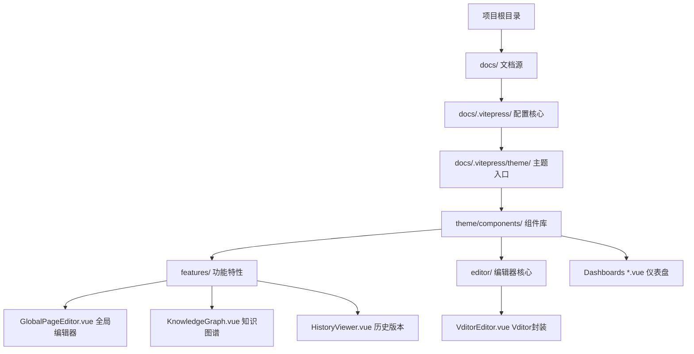

# 项目功能规格说明书：MetaUniverse-Blog

## 1. 项目元数据档案
- **项目定位**: 一个"数字孪生"级的大模型/AI研究知识管理系统。它不仅仅是一个静态博客，更是一个拥有高度定制化"类OS"Web界面、集成在线编辑、版本控制和知识可视化的动态系统。
- **技术架构图谱**:
  - **前端框架**: Vue 3.4+ (使用 `<script setup>`)
  - **静态生成器**: VitePress 1.0.2
  - **构建工具**: Vite 5.x
  - **状态管理**: Pinia 2.1 (Store模块: `app`, `layout`, `annotation`)
  - **样式方案**:原生 CSS 变量 + Tailwind Utility Classes (推测)
  - **路由方案**: VitePress 文件系统路由 + 针对编辑器的动态"虚拟"路由
  - **部署方式**: 静态构建 (`npm run build`) -> GitHub Pages / Netlify (标准 VitePress 流程)

### 目录结构拓扑图

---

## 2. 核心功能模块拆解

### 模块 1: "操作系统级" 在线编辑系统
**1. 功能概述**
   - **业务价值**: 允许作者直接在生产环境/预览环境编辑内容，无需切换回 IDE，实现"所见即所得" (WYSIWYG) 和即时持久化。
   - **用户场景**: 作者在浏览知识库时发现错误或有新灵感，直接唤起编辑器修改并升存。

**2. 详细功能点清单**
   - **2.1 全局编辑器覆盖层 (`GlobalPageEditor.vue`)**
     - **触发方式**: 自动在除 `/` (首页) 和 `/about/` (关于页) 之外的所有页面激活。
     - **技术实现**: 
       - 使用 Vue `<Teleport to=".VPDoc">` 将编辑器注入到主内容区域。
       - 通过 CSS (`display: none !important`) 强制隐藏 VitePress 的原始渲染内容。
     - **数据加载**: 通过 `GET /api/read-md?path={currentPath}` 获取文件内容。
       - *隐式逻辑*: 如果路径对应"影子文件" (如 `code.py.md`)，API 会智能解析并返回原始源码文件 (`code.py`)，从而实现对代码文件的直接编辑。
   
   - **2.2 Vditor 编辑器深度集成 (`VditorEditor.vue`)**
     - **核心库**: `vditor` (v3.9+).
     - **工具栏 (Toolbar) 定制**:
       - **配置**: 禁用了默认的大而全的工具栏，精简为高效写作模式：`emoji`, `headings`, `bold`, `italic`, `strike`, `link`, `list`, `table`, `undo`/`redo`。
       - **视觉样式**: 
         - **固定定位**: 使用 `fixed` 布局，吸附在顶部导航栏下方 (`top: 64px`)，左侧避开侧边栏 (`left: 280px`)。
         - **样式重写**: 强制覆盖 Vditor 原生样式，移除圆角，背景透明化，使其与页面背景融为一体。
         - **状态指示器**: 动态注入 DOM 的保存状态点 (绿/黄/红)，实时反馈后端同步状态。
     - **大纲导航 (Outline) 重构**:
       - **问题**: Vditor 原生大纲在 Shadow DOM 中且交互体验不佳。
       - **解决方案**: 在右侧边栏区域 (`.VPDocAside`) 渲染自定义大纲。
       - **交互逻辑**: 使用捕获阶段 (Capture Phase) 的事件委托，拦截点击，通过 ID 或文本匹配精准滚动到编辑器内部的对应标题位置。

   - **2.3 自动保存与持久化**
     - **触发机制**: 内容变更后的防抖监听器 (Debounce 2000ms)。
     - **数据流**: POST 请求至 `/api/save-md`。
     - **后端处理**:
       1.  **历史备份**: 在 `docs/.vitepress/history/` 下生成备份文件 `{文件名}_{时间戳}.md`。
       2.  **文件覆写**: 覆盖物理文件系统中的目标文件。
       3.  **Git 自动提交**: 立即执行 `git add` 和 `git commit -m "Auto-edit: ..."`，将变更固化到版本控制。

### 模块 2: 知识图谱可视化
**1. 功能概述**
   - **业务价值**: 可视化知识点之间的关联，帮助用户发现潜在的知识连接，构建网状知识体系。
   - **用户场景**: 用户读完"Transformer"文章后，希望查看所有引用了该概念或被该概念引用的其他文章。

**2. 详细功能点清单**
   - **2.1 双链解析 (`[[WikiLink]]`)**
     - **输入规格**: 用户输入 `[[Concept Name]]` 或 `[[Concept Name|Display Text]]`。
     - **构建时处理**: `config.ts` 中集成了自定义 `markdown-it` 插件：
       1.  扫描内容匹配正则 `\[\[(.*?)\]\]`。
       2.  将链接提取并存储到页面的 `frontmatter.wikiLinks`。
       3.  将文本渲染为 HTML 链接 `<a href="/posts/concept-name">`。
   - **2.2 图谱渲染 (`KnowledgeGraph.vue`)**
     - **核心库**: `cytoscape.js` + `cytoscape-dagre` 布局算法。
     - **数据源**: 消费当前页面的 `page.frontmatter.wikiLinks`。
     - **视觉表现**: 
       - 当前节点: 蓝色，放大显示。
       - 关联节点: 紫色。
       - 连线: 有向箭头及其层级关系。
     - **交互**: 点击节点触发 `router.go()` 跳转。

### 模块 3: 自动化导航与目录结构
**1. 目录映射规则 (`utils/sidebar.ts`)**
   - **核心逻辑**: 系统自动扫描 `docs/` 下的特定文件夹生成侧边栏，无需手动配置。
   - **支持的顶级栏目**: 
     - `posts` (技术文章), `papers` (论文), `essays` (杂谈), `thoughts` (想法), `yearly` (年终总结).
     - **知识库 (Knowledge)**: 特殊处理，每个子文件夹 (如 `docs/knowledge/ai-basis`) 被视为一个独立的"知识库"，拥有独立的侧边栏。

**2. 文件夹即节点**
   - **显示规则**: 文件夹在侧边栏中不仅是折叠容器，也可以是可点击的文档节点。
   - **优先级解析**:
     1.  **同级同名文件 (High Priority)**: 如果存在 `folder/` 和 `folder.md`，点击侧边栏的 "folder" 会导航到 `folder.md`。
     2.  **内部索引文件 (Medium Priority)**: 如果只存在 `folder/index.md`，点击则导航到该 index 文件。
     3.  **纯容器 (Low Priority)**: 如果既无同名文件也无 index，文件夹仅作为可折叠的父节点，不可点击导航。

### 模块 4: UI/UX 视觉设计系统
**1. 布局哲学 (`style.css`)**
   - **Strict Holy Grail Layout**: 采用强制的"圣杯布局"，通过 `position: fixed !important` 锁定顶部导航栏、左侧边栏和右侧大纲，确保它们不受内容区域滚动的影响。
   - **主要变量**:
     - `--mu-header-height`: 64px (顶部高度)
     - `--mu-sidebar-width`: 280px (左侧宽度)
     - `--mu-aside-width`: 224px (右侧宽度)

**2. 视觉风格**
   - **Glassmorphism (毛玻璃)**: 顶部导航栏和侧边浮动工具栏应用了 `backdrop-filter: blur(8px)`，营造现代通透感。
   - **Premium Design**:
     - **滚动条**: 自定义超细隐藏式滚动条，鼠标悬停时才显示，保持界面整洁。
     - **提示块 (Admonitions)**: 重写了 VitePress 默认的 Tip/Warning 样式，使用更柔和的背景色 (`rgba(r,g,b, 0.1)`) 和细边框，配合微交互（Hover 时上浮）。
   - **字体**: 分区定义，代码区域使用等宽字体，正文使用系统无衬线字体。

### 模块 5: 版本控制与"时光机"
**1. 功能概述**
   - **业务价值**: 为在线编辑系统提供安全网，防止误操作导致的数据丢失。
   - **用户场景**: 用户误删了一段重要代码，或者想回退到昨天的版本。

**2. 详细功能点清单**
   - **3.1 历史查看器 (`HistoryViewer.vue`)**
     - **两种模式**: 
       - **文件模式**: 显示当前文件的历史。数据来自 `/api/list-history` (本地备份) 和 `/api/git/log-folder` (Git 日志)。
       - **文件夹模式**: 显示当前目录的 Git 变更日志。
     - **差异对比 (Diff View)**: 
       - 使用 `diff` 库计算行级 (Line-by-line) 和 词级 (Word-by-word) 差异。
       - 左侧面板: 旧版本。右侧面板: 当前版本。
       - **同步滚动**: 自定义 JS 逻辑实现左右面板滚动条的精准同步。
   - **3.2 回滚机制**
     - **API**: `POST /api/rollback`。
     - **逻辑**: 使用 `history/{backup_file}` 的内容覆盖当前文件，或执行 `git checkout` (在特定路径下模拟)。

---

### 模块 6: 路由与页面映射表

**1. 顶层导航映射机制**
- **自动映射**: 顶部导航栏 (Navbar) 的每一项（除首页和关于）直接对应 `docs/` 目录下的一个顶级文件夹。
- **嵌套识别**: 系统自动扫描文件夹结构，识别嵌套的子目录和 Markdown 文件，动态生成下拉菜单或侧边栏索引。

**2. 特殊页面组件化**
与标准文档页不同，以下页面采用"纯 Vue 组件"模式构建，不依赖 Markdown 内容渲染：
- **首页 (`/`)**: 
  - **实现**: `docs/index.md` 仅作为容器，核心内容由 `<PostsDashboard />` 组件接管。
  - **功能**: 展示文章列表、标签云、动态粒子背景。
- **关于页 (`/about/`)**:
  - **实现**: `docs/about/index.md` 挂载 `<AboutProfile />` 组件。
  - **功能**: 展示个人简历、技能雷达图、社交链接。

| 路由路径 | 组件/实现方式 | 功能描述 |
| :--- | :--- | :--- |
| `/` | `<PostsDashboard />` | **首页**。全屏 Vue 组件，集成粒子特效与文章聚合流。 |
| `/knowledge/` | `KnowledgeDashboard.vue` | **知识库仪表盘**。聚合所有知识库子目录的统计信息。 |
| `/about/` | `<AboutProfile />` | **关于我**。独立的个人展示页，非文档流布局。 |
| `/posts/*` | `GlobalPageEditor.vue` | **标准文章页**。支持 Markdown 渲染 + 全局编辑器覆盖层。 |

---

### 第四部分：配置与构建系统分析

#### 4.1 Backend-for-Frontend (BFF) 中间件
位于 `docs/.vitepress/config.ts` 中的 `configureServer` 钩子充当了完整的后端服务：
- **文件系统 API**:
  - `/api/files/list`: 列出目录内容。
  - `/api/files/create/delete/rename`: 完整的文件 CRUD 操作。
- **Git 自动化**:
  - 直接在开发服务器中注入 `execSync('git add ...')` 命令，实现自动提交。
- **静态生成增强**:
  - `transformPageData`: 构建钩子，用于在构建时计算字数 (Word Count) 和提取 WikiLinks。

#### 4.2 影子文件生成 (`gen-shadow.ts`)
- **目的**: 让非 Markdown 文件（Python, C++, Jupyter Notebooks）也能在博客中作为"一等公民"展示和被索引。
- **流程**:
  - 扫描 `docs/**/*.py`, `docs/**/*.ipynb` 等源文件。
  - 为每个源文件生成一个伴生的 `.md` 文件 (例如: `script.py` -> `script.py.md`)。
  - **.ipynb 处理**: 解析 JSON 单元格并转化为 Markdown 代码块。
  - **源码处理**: 使用 `::: code-group` 语法包裹，提供语法高亮。

---

### 第五部分：问题诊断与改进建议

#### 5.1 代码异味与架构风险
- **安全风险 (Critical)**: `docs/.vitepress/config.ts` 中的 `/api/*` 端点**缺乏任何身份验证**。虽然它们仅在 `config.ts` (开发/构建环境) 中定义，但如果开发服务器暴露给局域网或公网，攻击者可利用 `/api/files/*` 对服务器文件系统进行任意读写 (RCE 风险)。
- **硬编码逻辑**:
  - `GlobalPageEditor.vue` 中硬编码了只读路由 `READ_ONLY_ROUTES = ['/']`。
  - `KnowledgeDashboard.vue` 中根据标题字符串包含 (`title.includes('导论')`) 来硬编码图标映射。这种逻辑非常脆弱，建议移至配置文件。
- **性能隐患**:
  - `HistoryViewer.vue` 会一次性加载目标路径的所有历史文件列表。如果历史记录积累过多，会导致接口响应变慢。
  - **Git 噪音**: 每次自动保存 (2秒防抖) 都会触发 Git Commit，这会产生大量琐碎的 Commit 记录。

#### 5.2 功能缺失
- **文件夹回滚**: `HistoryViewer` 的 UI 中虽有"Restore"按钮用于文件夹历史，但在扫描的配置中，后端 `/api/git/checkout` 逻辑似乎不完整或依赖于未完全展示的通用命令执行器。
- **RAG 搜索**: `RAGSearch.vue` 目前是**模拟数据 (Mock)**。它返回关于 "Transformers" 的硬编码响应，尚未连接真实的向量数据库或 LLM API。

#### 5.3 优先级矩阵

| 功能点 | 优先级 | 建议行动 |
| :--- | :--- | :--- |
| **API 安全加固** | 🚨 紧急 | 为 `/api/*` 端点添加基础的 Token 验证，或确保仅监听 `localhost`。 |
| **RAG 后端接入** | 🔴 高 | 替换 `RAGSearch` 的模拟逻辑，接入 OpenAI/Gemini API 和向量检索服务。 |
| **Git 提交优化** | 🟡 中 | 将"自动保存即提交"改为"手动按钮提交"或"每日自动压缩(Squash)"，减少 Git 历史噪音。 |
| **配置解耦** | 🟡 中 | 将图标映射和只读路由配置移至 `themeConfig`，避免在组件中硬编码。 |
